# 实验一：Linux 常用命令

第六组

## 实验目的

+ 熟悉 VirtualBox 虚拟机的使用。
+ 熟悉 Ubuntu 操作系统。
+ 掌握常用的 Linux 命令。

## 实验设备

+ 硬件：PC 机。
+ 软件：VirtualBox 虚拟机和 Ubuntu 操作系统。

## 实验预习要求

+ 阅读第 1.3 节关于 Linux 的安装和使用。
+ 阅读第 1.5 节 Linux 常用操作命令。

## 实验内容

+ 基于虚拟机的 Linux 操作系统的使用。
+ 与文件和目录相关的命令的使用。
+ 磁盘管理和维护命令的使用。
+ 系统管理和设置命令的使用。
+ 网络相关命令的使用。
+ 压缩备份命令的使用。

## 实验步骤

+ ### 基于虚拟机的 Linux 操作系统的使用

#### 1. 启动 VirtualBox 应用程序，启动 Windows，选择“开始 - 程序 - VirtualBox”，弹出如图所示界面，点击“开始”运行 Linux 操作系统。

#### 2. 系统启动后，需要输入用户名和密码，如图所示。在此输入密码。

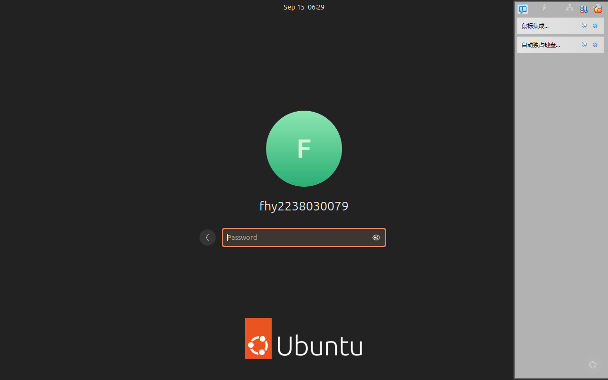

#### 3. 启动终端，成功进入系统后，选择“应用程序 - 终端”，如图所示。

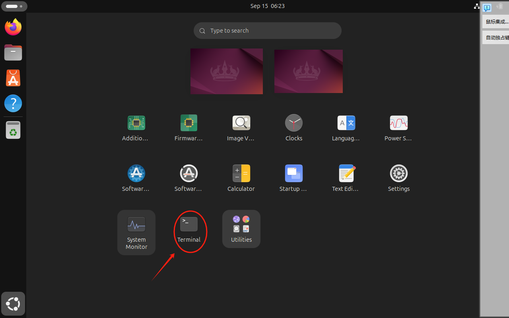

#### 4. 在终端执行 Linux 命令，终端运行后可以在此输入 Linux 命令，并按回车键执行，如图所示。

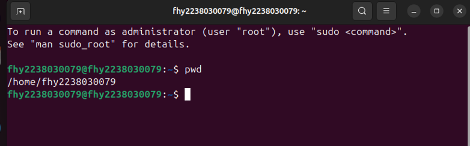

_

**_相关视频演示可查看 [assets/5.1/shipin.mp4](https://github.com/Bier2004/common-commands-in-Linux/blob/main/assets/5.1/shipin.mp4)_**

_

+ ### 与文件和目录相关的命令的使用

#### 1. 查询 /bin 目录，查看目录中有哪些常用命令文件：

`ll /bin`

#### 2. 进入 /tmp 目录并创建一个新目录 myshare：

`cd /tmp`

`mkdir myshare`

`ls -ld myshare/`

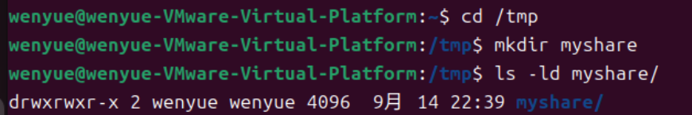

#### 3. 使用 pwd 命令查看当前目录：

`pwd`

#### 4. 创建一个新的 testfile 文件：

`touch testfile`

`ls -ld myshare/`

#### 5. 设置文件的权限模式：

`chmod 755 testfile`

`ls -l testfile`

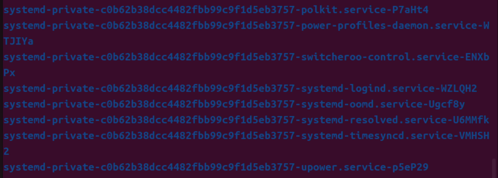

#### 6. 将文件备份到 /tmp/myshare 目录并更名为 testfile.bak：

`cp testfile myshare/testfile.bak`

`ls -l myshare/`

#### 7. 为 /root 目录下的文件创建一个符号链接：

`ln -s /tmp/testfile /root/testfile.ln`

`ls -l /root/testfile.ln`

#### 8. 在 inittab 文件中查找包含 initdefault 字符串的行：

`cat /etc/inittab | grep initdefault`

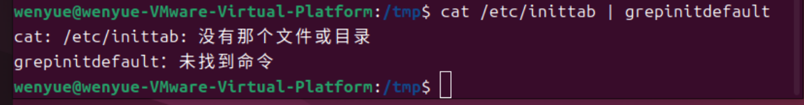

_

**_相关视频演示可查看 [assets/5.2/shipin.mp4](https://github.com/Bier2004/common-commands-in-Linux/blob/main/assets/5.2/shipin.mp4)_**

_

+ ### 磁盘管理和维护命令的使用

#### 在 Linux 下使用光驱的步骤

##### 确认光驱对应的设备文件

`ls /dev/cdrom`

##### 挂载光驱

`mount -t iso9660 /dev/cdrom testdir`

##### 查询挂载后的目录

`ls /media/cdrom`

 

##### 卸载 testdir

`umount /dev/cdrom`

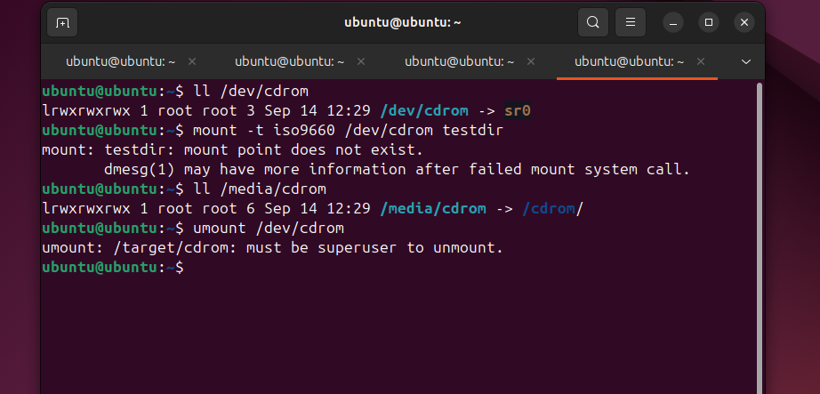 

#### 在 Linux 下使用 USB 设备

##### 挂载 U 盘并查看系统识别的磁盘。

`cat /proc/partitions`

 

##### 创建挂载点

`mkdir /mnt/usb`

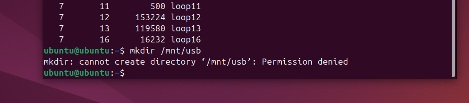

`mount -t vfat -o codepage=936,iocharset=gb2312 /dev/sdb1 /mnt/usb`

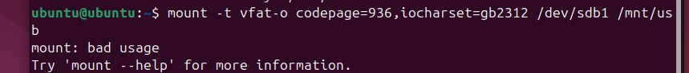

##### 卸载 U 盘

`umount /mnt/usb`

_

**_相关视频演示可查看 [assets/5.3/shipin.mp4](https://github.com/Bier2004/common-commands-in-Linux/blob/main/assets/5.3/shipin.mp4)_**

_

+ ### 系统管理和设置命令的使用

#### 1. 查看系统中的所有进程

`ps -ef`

#### 2. 查找 ssh 服务守护进程的进程 ID 号

`ps -ef | grep sshd`

#### 3. 如果 ssh 服务守护进程出现问题，则强制终止进程

`kill -9`

#### 4. 系统关闭

`shutdown`

_

**_相关视频演示可查看 [assets/5.4/shipin.mp4](https://github.com/Bier2004/common-commands-in-Linux/blob/main/assets/5.4/shipin.mp4)_**

_

+ ### 网络相关命令的使用

#### 1. 显示当前网络的信息

运行以下命令

`ifconfig`

可以显示当前网络的信息，操作结果如图所示

如果出现图中所示的提示，您可以运行图中显示的命令安装该软件包并重试

`sudo apt install net-tools`

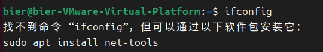

#### 2. 设置 IP 地址

运行以下命令

`ifconfig ens33 192.168.1.10`

可以将 ens33 的 IP 地址设置为 192.168.1.10

如果出现以下提示

可以在命令前添加 `sudo` 提升权限，即运行

`sudo ifconfig ens33 192.168.1.10`

操作后，可以观察到 IP 发生了变化

#### 3. 设置子网掩码

运行以下命令

`ifconfig ens33 netmask 255.255.255.0`

可以将 ens33 的子网掩码设置为 255.255.255.0

操作后，可以观察到子网掩码的变化

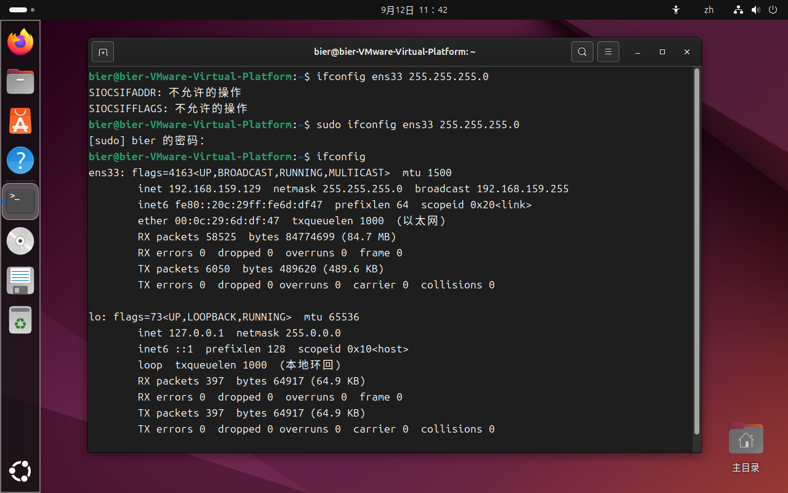

#### 4. 禁用网卡

运行以下命令

`ifconfig ens33 down`

可以观察到网卡 ens33 已被禁用

#### 5. 测试网络连通性

运行以下命令

`ping 127.0.0.1`

结果如下

这表明本地网络循环是正常的

#### 6. 启用网卡

运行以下命令

`ifconfig ens33 up`

可以观察到网卡 ens33 已启用

#### 7. 显示内核路由表

运行以下命令

`netstat -r`

显示内核路由表

结果如图所示

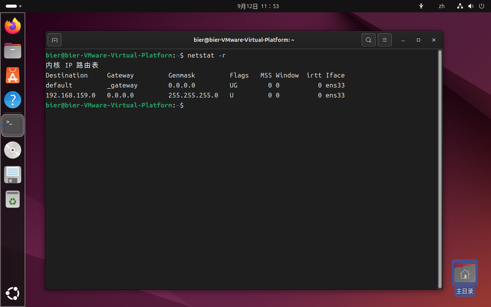

#### 8. 显示 TCP 连接状态

运行以下命令

`netstat -t`

显示 TCP 连接状态

结果如图所示

#### 9. 显示 UDP 连接状态

运行以下命令

`netstat -u`

显示 UDP 连接状态

结果如图所示

_

**_相关视频演示可查看 [assets/5.5/shipin.mp4](https://github.com/Bier2004/common-commands-in-Linux/blob/main/assets/5.5/shipin.mp4)_**

_

+ ### 压缩备份命令的使用

#### ① 将 /tmp 目录打包为 tmp.tar 并放置在 /root 目录中。

`tar cf /root/tmp.tar /tmp/*`

#### ② 将 /tmp 目录压缩并打包为 tmp.tar.gz，放置在 /root 目录中：

`tar zcvf /root/tmp.tar.gz /tmp/*`

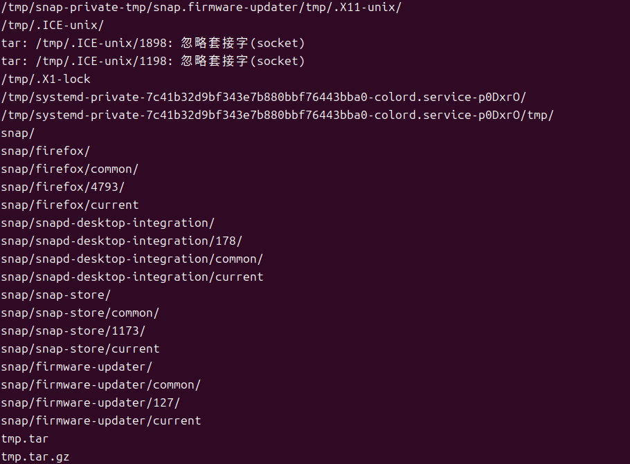

#### ③ 比较 tmp.tar 和 tmp.tar.gz 的大小：

`ls -l /root/tmp.tar /root/tmp.tar.gz`

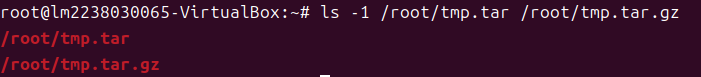

#### ④ 不解压，仅查看压缩文件 tmp.tar.gz 的内容：

`tar ztf /root/tmp.tar.gz`

#### ⑤ 将 tmp.tar.gz 的内容解压到 /tmp/myshare 目录中：

`tar zxvf /root/tmp.tar.gz -C /tmp/myshare/`

#### ⑥ 将 /tmp 目录中的每个文件压缩为 .gz 格式：

`gzip *`

#### ⑦ 详细列出每个 .gz 压缩文件的信息，无需解压：

`gzip -l *`

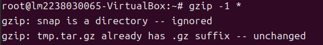

#### ⑧ 解压每个 .gz 压缩文件并提供详细信息：

`gzip -dv *`

_

**_相关视频演示可查看 [assets/5.6/shipin.mp4](https://github.com/Bier2004/common-commands-in-Linux/blob/main/assets/5.6/shipin.mp4)_**

_

## 问题

**1**  

### 使用 `ls` 命令查看 `/root` 下的信息并重定向结果保存到 `test.txt` 文件中。

运行以下命令：

`sudo ls /root/ `    

> 查看 /root 目录下的所有文件和子目录信息。

`sudo ls /root > test.txt`

> 将 /root 目录下的文件列表写入 test.txt 文件。

**2**

### 使用磁盘管理和维护命令将 USB 驱动器挂载到虚拟机，并将问题 1 中生成的 `test.txt` 文件复制到 USB 驱动器。

运行以下命令：

`sudo cp /tmp/test.txt /mnt/usb/`

> 将 /tmp 目录中的 test.txt 文件复制到 USB 驱动器。

`ls /mnt/usb`

> 检查文件是否已成功复制到 USB 驱动器。

**3**

### 使用 `ifconfig` 将 `eth0` 的 IP 地址更改为 `10.3.0.159` 并将子网掩码修改为 `255.0.0.0`。

运行以下命令：

`sudo ifconfig enp0s3 10.3.0.159`

> 更改 IP 地址

`sudo ifconfig enp0s3 netmask 255.0.0.0`

> 更改子网掩码

`ifconfig enp0s3`

> 验证修改

**4**

### 压缩和归档的区别是什么？

> 

**_压缩：_** _指使用特定的算法减少文件的大小。常用的工具包括 gzip 和 bzip2。压缩后的文件通常是单个文件。压缩可以是无损的（解压后数据完全恢复）或有损的（解压后某些数据丢失，但对最终用途的影响通常可以忽略不计）。_

**_归档：_** _涉及将多个文件或目录合并成一个文件。常用的工具是 tar。归档后的文件大小可能不变，但便于传输和存储。也就是说，归档文件的大小可能等于它们替代的各个文件的总和。常见的归档格式包括 .tar（磁带归档）。_

_

_

_

_

_

# 小组成员及分工

### zrz181-郑润泽

+ 实验目的
+ 实验设备
+ 实验预习要求
+ 实验内容

### wangwen128-付恒义

+ 基于虚拟机的 Linux 操作系统的使用

### HKING10086-李航

+ 与文件和目录相关的命令的使用

### bingren0106-胡家宝

+ 磁盘管理和维护命令的使用

### Gaoxingheiheihei-褚孟凡

+ 系统管理和设置命令的使用

### Bier2004-尚千斌

+ 仓库和目录的建立和规范
+ 文档格式的规范和修改
+ 文档内容的审核
+ 添加和修改注释
+ 网络相关命令的使用

### lakeforever-刘淼

+ 压缩备份命令的使用

### Tongziiii-张振达

+ 问题部分

### Lorinda0719-段奕铭

+ 文档格式和内容的修改
+ 实验视频的录制

### z4459-王众

+ 实验视频的录制

_

_

_

+ ### 原仓库链接请点[这里](https://github.com/Bier2004/common-commands-in-Linux)
+ [https://github.com/Bier2004/common-commands-in-Linux](https://github.com/Bier2004/common-commands-in-Linux)
