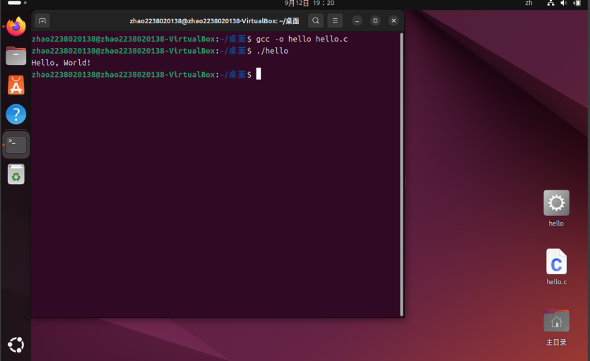
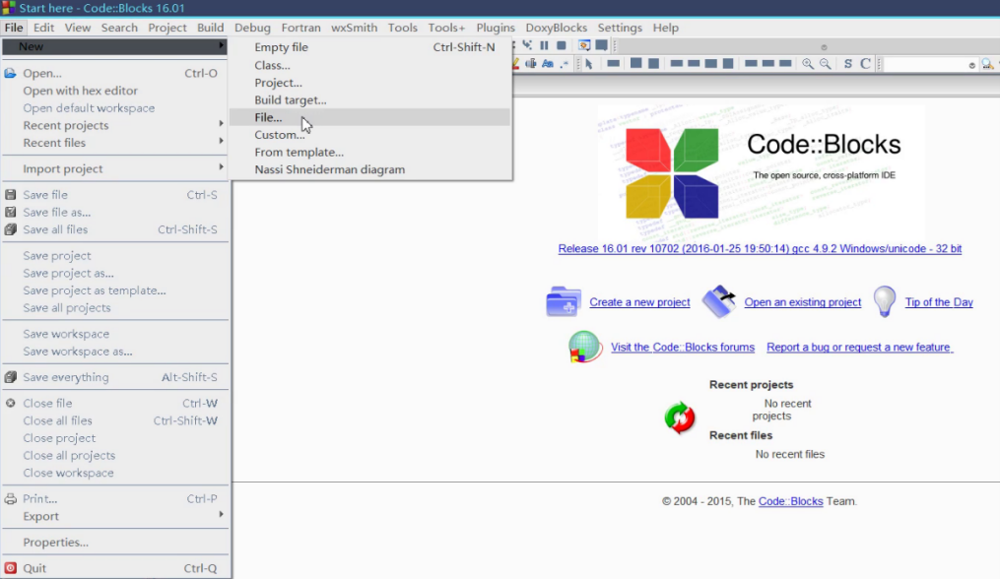

# 实验2

## 1. 实验目标

① 熟悉Ubuntu下的C语言开发环境。  

② 掌握Vi、GCC和GDB的使用。  

③ 掌握Linux下的C语言编程流程。  

④ 掌握Linux下的集成开发环境。

## 2. 实验设备

硬件：PC。  

软件：VirtualBox虚拟机，Ubuntu操作系统。

## 3. 实验预习要求

① 阅读第2.1.2节，熟悉Linux下的C语言开发流程。  

② 阅读第2.2节，掌握Vim编辑器的使用。  

③ 阅读第2.3节，掌握GCC编译器的使用。  

④ 阅读第2.4节，掌握GDB调试器的使用。  

⑤ 阅读第2.5节，掌握Make工程管理器。  

⑥ 阅读第2.6节，熟悉CodeBlocks集成开发环境。

## 4. 实验内容

① Linux下的C语言开发流程。  

② Vi和Vim编辑器的使用。  

③ GCC编译器的使用。  

④ GDB调试器的使用。  

⑤ Make工程管理器的使用。  

⑥ 熟悉CodeBlocks集成开发环境。

## 5. 实验步骤

### （1）**Linux下的C语言开发流程（参考第2.1节）**

① 启动虚拟机，进入操作系统，然后按快捷键“**Ctrl + Alt + T**”启动终端。

② 进入root模式。如果之前未进入root模式，输入用户密码并为root模式设置新密码；如果之前已设置root模式，输入命令“`su root`”进入。

如图图2-1所示

③ 更新目录，方便安装Vim编辑器、GCC编译器等：`sudo apt update` 

④ 安装Vim编辑器：`apt-get install vim` 

⑤ 安装GCC编译器：`apt-get install gcc`

⑥ 安装build-essential：`sudo apt install build-essential`

⑦ 使用Vim编辑源程序，在终端中输入“`vi Hello.c`”启动Vi编辑器，并进入命令行模式。启动后，按“**i**”键进入插入模式。如果左下角出现“Insert”提示，用户可以编辑文本。输入`Hello.c`源代码，如图图2-2所示。

最后，按Esc键将插入模式转换为命令行模式，输入命令“`:wq`”退出。 

⑧ 编译源代码，在终端下输入命令“`gcc Hello.c -o Hello`”进行编译。 

⑨ 运行程序，在终端下输入命令“`./Hello`”运行。如图2-3所示。

### （2）**Vi、Vim编辑器的使用（参考第2.2节）**

① 启动和退出Vim，在终端输入命令“`vim`”启动。如果退出Vim，按“**Esc**”返回命令行模式，然后输入“`:q`”，按“**Enter**”退出。

② 在三种模式（命令模式、编辑模式和底行模式）之间切换，以及在三种模式下使用常用命令。  

#### 三种模式的常用命令如下：

#### (1) 命令模式

##### 1. 光标移动命令

`h`：向左移动光标  

`j`：向下移动光标  

`k`：向上移动光标  

`l`：向右移动光标  

`w`：按单词向前移动  

`b`：按单词向后移动  

`Shift + ^`：将光标定位到当前行的最左端  

`Shift + $`：将光标定位到当前行的最右端  

`gg`：跳到文件顶部  

`Shift + G`：跳到文件末尾  

##### **2.** **文本编辑命令**

`n + x`：删除光标所在位置的字符。n表示要删除的字符数  

`n + X`：删除光标左侧的字符。n表示要删除的字符数  

`n + yy`：复制当前行。n表示要复制的行数  

`n + p`：粘贴剪切或复制的文本，n表示粘贴的次数  

`n + dd`：删除当前行。n表示要删除的行数  

`u`：撤销编辑操作  

`Ctrl + r`：重做撤销  

`.`：重复上一次操作  

`~`：快速切换字符大小写  

**3.** **查找和替换命令**

`n + r`：替换光标所在位置的字符。n表示要替换的字符数  

`R`：进入替换模式  

`#`：高亮显示要查找的函数名  

`n`：查找下一个函数/字符串  

`/pattern`：向后查找指定模式  

`?pattern`：向前查找指定模式  

`s/search/replace/g`：替换搜索内容  

`s/search/replace/gc`：替换搜索内容，但每次替换前进行确认  

#### (2) 插入模式

在命令模式下，按`i`进入输入模式，使用**ESC**键返回命令模式。在输入模式下，可以使用以下按键：

字符大小写和**Shift**组合：输入字符  

**ENTER**：回车键，换行  

**BACK SPACE**：退格键，删除光标前的字符  

**DEL**：删除键，删除光标后的字符  

方向键：在文本中移动光标  

**HOME/END**：将光标移动到行的开头/结尾  

**PgUp/PgDn**：向上/向下翻页  

**Insert**：切换光标为输入/替换模式，光标变为竖线/下划线  

**ESC**：退出输入模式，切换到命令模式  

#### (3) 底行模式

在Vim的底行模式下，可以执行各种操作，如保存文件、搜索文件、替换文本等。以下是一些常用的Vim底行模式命令及其功能：

**1.** **保存和退出**

`:w`：保存文件但不退出  

`:w 文件名`：将文件另存为指定的文件名  

`:q`：退出Vim  

`:q!`：强制退出，不保存更改  

`wq` 或 `:x`：保存并退出  

**2.** **显示行号和鼠标操作**

`set number`：显示行号  

`set nonumber`：隐藏行号  

`set mouse=a`：设置鼠标操作  

`set` 选项：设置Vim选项，例如，`set number`表示显示行号  

**3.** **移动光标**

`n`：跳转到第n行  

`$`：跳转到文件末尾  

`1`：跳转到文件开头  

**4.** **文件操作**

`:e 文件名`：打开另一个文件进行编辑  

`:r 文件名`：将另一个文件的内容插入到当前文件中  

`:sav 文件名`：另存为指定的文件名  

**5.** **执行外部命令**

`:!命令`：执行外部命令，例如：`:!ls` 列出当前目录文件  

#### 完成以下练习：

在“/root”目录下创建一个名为“/Vi”的目录：`mkdir /Vi`

进入“/Vi”目录：`cd /Vi`

将“/etc/systemd/system.conf”文件复制到“/Vi”目录：`cp /etc/systemd/system.conf /Vi/`

使用Vi命令打开“/Vi”中的**system.conf**文件：`vim /Vi/system.conf`

设置行号：`:set nu`

移动光标到第17行：`17:<enter>`

复制该行内容：`yy`

移动光标到最后一行的开头：`G`

粘贴复制的内容：`p`

撤销上一步操作：`u`

将光标移动到最后一行的末尾：`$`

删除该行：`dd`

保存但不退出：`:w`

将光标移动到第一行：`1G`

在插入模式中输入“`Hello,this is Vi world!`”：**按 `i` 并输入“`Hello,this is Vi world!`”**

返回命令模式：**Esc**

查找向下的字符串“`DefaultLimitNOFILE=`”：`/DefaultLimitNOFILE=`

再次查找字符串“LogLevel=”：`?LogLevel=`

保存文件但不退出：`:w`

强制退出Vi而不保存：`:q!`

### （3）**GCC编辑器的使用（参考第2.3节）**

#### **1）** **GCC编译过程**

主要分为四个过程：预处理、编译、汇编和链接。

#### **2）** **GCC编译命令**

首先使用Vi创建一个**hello.c**文件，输入“`vi hello.c`”，按“`i`”进入插入模式，编写程序，编辑后保存，程序源代码如下：

要编译此程序，首先在命令行下输入“`gcc -o hello hello.c`”，GCC编译器生成一个可执行文件，然后输入“`./hello`”可以看到程序的输出。

可以使用不同的gcc选项来控制gcc的编译过程，分离gcc的编译过程：

仅进行预处理，并生成.i文件：

`gcc -E -o hello.i hello.c`

仅进行编译操作，生成.s文件：

`gcc -S -o hello.s hello.i`

仅进行汇编操作，生成.o文件：

`gcc -c -o hello.o hello.s`

仅进行链接操作，将.o文件链接生成最终的可执行文件：

`gcc -o hello hello.o`

#### **3）** **常用编译选项**

|  常用选项   | 描述                                                 |
| :---------: | :--------------------------------------------------- |
|     -E      | 预处理，在开发过程中想快速确定某个宏可以使用“-E -dM” |
|     -c      | 把预处理、编译、汇编都做了，但是不链接               |
|     -o      | 指定输出文件                                         |
| -I（大写I） | 指定头文件目录                                       |
|     -L      | 指定链接时库文件目录                                 |
| -l（小写L） | 指定链接哪一个库文件                                 |

例如，使用“-I”参数指定头文件目录：

头文件目录为当前目录：

`gcc -c -o main.o main.c -I`

#### **4）** **编译多个文件**

① 使用GCC编译器将main.c和sub.c源代码文件一起编译并链接成一个名为test的可执行文件。

`gcc -o test main.c sub.c`

② 使用GCC编译器将main.c编译成目标文件（对象文件）main.o。

`gcc -c -o main.o main.c`

③ 将sub.c编译成目标文件sub.o。

`gcc -c -o sub.o sub.c`

④ 将之前编译的目标文件main.o和sub.o链接成一个名为test的可执行文件。

`gcc -o test main.o sub.o`

#### **5）** **使用GCC检查程序中的错误**

使用以下源代码，使用GCC进行错误检查，警告提示。

不难发现代码中的以下错误：

> main函数的返回值声明为void，但实际上应该是int；

> 使用CNU语法扩展，使用long long声明64位整数，但不符合ANSI/ISO语言标准；

> main函数在没有返回值的函数中调用了return语句。

当GCC编译不符合ANSI/ISO语言标准的源代码时，使用“`-pedantic`”选项，会对使用扩展语法生成警告信息。

并且“`-Wall`”选项启用GCC生成更多的警告：

### （4）**GDB基本命令的使用（参考第2.4节）**

1). 进入Vim并输入“`vim greet.c`”

2). 输入“`i`”进入插入模式，输入以下源代码

3). 编辑完成后，保存并退出，输入“`:wq`”

4). 使用GCC编译：`gcc -g greet.c -o greet`

5). 运行：`./greet`

6). 启动GDB调试：`gdb greet`

7). 查看源代码：`list 1`

8). 在第20行（for循环）设置断点：`break 20`

9). 在第23行（printf函数）设置断点：`break 23`

10). 查看断点设置情况：`info breakpoints`

11). 运行代码：`run`

12). 单步运行代码：`next`

13). 查看暂停点变量值：`print string2[size-i]`

14). 多次运行代码并使用命令查看string2数组的值。

15). 继续程序运行：`continue`

17). 退出GDB：`quit`

### （5）**Make工程管理器的使用（参考第2.5节）**

#### 实验目标

- 掌握使用Vi编辑器编辑C语言源代码文件。
- 学习如何手动编写Makefile文件以自动化编译过程。
- 理解并实践使用Make工具编译项目。
- 探索使用自动生成工具。

#### 实验环境

- Linux操作系统
- Vi文本编辑器
- GCC编译器
- Make工具
- Automake（可选，用于自动生成Makefile）

#### 实验步骤

##### _步骤1：编辑源代码_

- 打开终端：启动Linux终端。

- 创建并编辑hello.c文件：

  * 输入命令`vi hello.c`打开或创建hello.c文件。

  - 在Vi编辑器中，输入以下C语言代码：
  
  - 

  * 按“**Esc**”键退出插入模式，然后输入“`:wq`”保存并退出Vi编辑器。

  

##### _步骤2：手动编写Makefile_

- 创建Makefile文件：

  * 输入命令“`vi Makefile`”创建或编辑Makefile文件。

  - 在Vi编辑器中，输入以下内容：

  - 保存并退出Vi编辑器。

  

##### _步骤3：使用Make编译项目_

- 在终端中编译项目：

  * 输入命令“`make`”并按**Enter**。

  - 观察输出，确认是否成功生成“hello”可执行文件和“hello.o”对象文件。

  - 通过输入命令“`./hello`”运行程序，检查输出是否为“Hello, Make!”.

  

##### _步骤4：使用自动生成工具生成Makefile_

- 在指定目录下创建一个名为Makefile或makefile的文件

- 在终端输入“`make`”，默认执行Makefile文件 

- 指定执行一个makefile文件

### （6）**熟悉CodeBlocks集成开发环境（参考第2.6节）**

1). 安装Code::Blocks

首先，需要从官方网站 <https://www.codeblocks.org/downloads/> 下载适用于操作系统的Code::Blocks版本。安装过程通常很简单，按照安装向导的指示操作即可。

2). 了解Code::Blocks界面

安装后，打开Code::Blocks，会看到一个直观的用户界面。主要包括菜单栏、工具栏、项目浏览器、编辑窗口、日志窗口等部分。熟悉这些界面元素是高效使用Code::Blocks的基础。

3). 创建和管理项目

在Code::Blocks中，可以通过创建项目来组织和管理代码。点击“**文件-> 新建-> 项目...**”，选择一个项目类型（如控制台应用程序），并按照向导指示创建项目。创建完成后，可以在项目浏览器中看到项目结构和文件列表。

4). 编写和编译代码

在编辑窗口中编写代码，保存后，可以通过点击工具栏上的“**构建并运行**”按钮或按快捷键（如**F9**）编译项目。编译成功后，可以在日志窗口中看到编译信息。

5). 调试代码

Code::Blocks内置了强大的调试功能，帮助查找和解决代码中的错误。要调试代码，首先需要设置断点（在代码行号区域右键点击并选择“**切换断点**”）。然后，点击工具栏上的“**调试**”按钮或按快捷键（如**F8**）开始调试。调试过程中，可以查看变量值、单步执行代码、进出函数等。

6). 实践技巧

① 使用代码模板：Code::Blocks支持自定义代码模板，可以帮助快速生成常用的代码结构，提高编写效率。

② 自动完成：在编辑器中输入代码时，Code::Blocks会根据上下文自动提示可能的完成选项，减少输入错误。

③ 外部库管理：如果需要在项目中使用外部库，可以通过“设置” -> “编译器...” -> “链接器设置”配置库文件的路径和链接选项。

④ 自定义快捷键：Code::Blocks允许自定义快捷键，以更快地执行常用操作。

**Code::Blocks的使用**

**1)** **通过点击左上角的文件-> 新建-> 文件创建文件**

##### 2) 选择类别

##### 3) 命名并保存。

##### 4) 输入代码，然后保存Ctrl + S。

##### 5) 查看按键按钮功能，可以编译然后执行，或直接编译+执行。

##### 6) 编译后会在此处显示错误信息或警告

##### 7) 编译后执行。

## 6. 思考题

(1) 将hello.c编译成ARM架构的可执行程序。  

(2) 什么是远程调试？  

(3) 程序化输入任意两个小于100的整数a和b，然后输出100以内a和b的所有数，并使用GCC和GDB进行编译和调试。

## 小组成员及其负责部分

#### 马紫涵

+ 5.1 Linux下的C语言开发流程
+ 5.2 Vi、Vim编辑器的使用

#### 蒋芷宁，赵一骜

+ 5.3 GCC编辑器的使用

#### 高照，王博

+ 5.4 GDB基本命令的使用

#### 贺柏量，王昀韬

+ 5.5 Make工程管理器的使用

#### 胡益赫，赵世文

+ 5.6 熟悉CodeBlocks集成开发环境

#### 姚睿朋

+ 仓库和目录的建立与规范
+ 使用markdown语法整理和编辑文件

## 请点击[这里](https://github.com/Bier2004/common-commands-in-Linux)访问原始仓库

+ <https://github.com/suki202/-Linux-C-.git>
