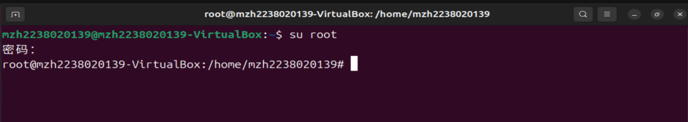
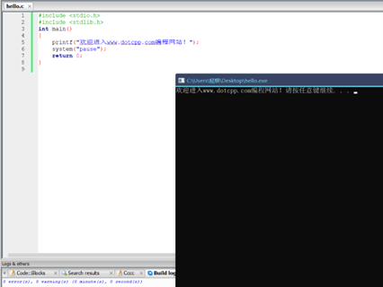

#                          实验二

## 1. 实验目的

① 熟悉 Ubuntu 下的 C 语言开发环境。

② 掌握 Vi、GCC 和 GDB 的使用。

③ 掌握 Linux 下的 C 语言编程过程。

④ 掌握 Linux 下的集成开发环境。

## 2. 实验设备

硬件：PC。  

软件：VirtualBox 虚拟机，Ubuntu 操作系统。

## 3. 实验预习要求

① 阅读第 2.1.2 节，熟悉 Linux 下的 C 语言开发过程。

② 阅读第 2.2 节，掌握 Vim 编辑器的使用。

③ 阅读第 2.3 节，掌握 GCC 编译器的使用。

④ 阅读第 2.4 节，掌握 GDB 调试器的使用。

⑤ 阅读第 2.5 节，掌握 Make 工程管理器。

⑥ 阅读第 2.6 节，熟悉 CodeBlocks 集成开发环境。

## 4. 实验内容

① Linux 下的 C 语言开发过程。

② Vi 和 Vim 编辑器的使用。

③ GCC 编译器的使用。

④ GDB 调试器的使用。

⑤ Make 工程管理器的使用。

⑥ 熟悉 CodeBlocks 集成开发环境。

## 5. 实验步骤

#### **（1）** Linux 下的 C 语言开发过程（参考第 2.1 节）

① 启动虚拟机，进入操作系统，然后按快捷键“Ctrl + Alt + T”启动终端。

② 进入 root 模式。如果之前没有进入 root 模式，请输入用户密码并设置新密码；如果之前已设置 root 模式，输入命令“`su root`”进入。

如图 2-1 所示：

③ 更新目录以便于安装 Vim 编辑器、GCC 编译器等：`sudo apt update` 

④ 安装 Vim 编辑器：`apt-get install vim` 

⑤ 安装 GCC 编译器：`apt-get install gcc `

⑥ 安装 build-essential：`sudo apt install build-essential`

⑦ 使用 Vim 编辑源程序，在终端中输入 "`vi Hello.c`"，启动 Vi 编辑器，进入命令行模式。启动后，按下“i”键进入插入模式。如果左下角出现“Insert”提示，用户可以编辑文本。输入 `Hello.c `源代码，如图 2-2 所示。

最后，按 Esc 将插入模式转换为命令行模式，输入命令 "`:wq`" 退出。

⑧ 编译源代码，在终端下输入命令 "`gcc Hello.c -o Hello`" 进行编译。

⑨ 运行程序，在终端下输入命令 "`. / Hello` " 运行。如图 2-3 所示。

#### **（2）Vi 和 Vim 编辑器的使用（参考第 2.2 节）**

① 启动和退出 Vim，在终端输入命令 "`vim`" 启动。退出 vim 时，按 "Esc" 返回命令行模式，然后输入 "`:q`" 并按 "Enter" 退出。

② 在 3 种模式（命令模式、编辑模式和底行模式）之间切换，以及 3 种模式中的常用命令的使用。命令行模式下的常用功能键列在表 3-1 中。底行模式的常用功能键列在表 3-2 中。完成以下操作练习。

1) 在 `/root` 目录下创建名为 `/Vi` 的目录：`mkdir /Vi` 

2) 进入 `/Vi` 目录：`cd /Vi` 

3) 将文件 "/etc/systemd/system.conf" 复制到 "/Vi" 目录：`cp /etc/systemd/system.conf /Vi/` 

4) 使用 Vim 打开 /Vi 目录中的 system.conf 文件：`vim /Vi/system.conf` 

5) 设置行号：`:set number` 

6) 查找特定的行或设置：使用 “/” 加上要搜索的字符串，例如 “`/DefaultLimitNOFILE=`”，然后按“Enter”找到特定设置。 

7) 复制、粘贴和移动光标：在命令行模式下，使用 “`yy`” 复制当前行，“`p`” 粘贴复制的内容，“`G`” 移动到文件末尾，“`gg`” 到文件开头，“`0`” 到行首，“`$`” 到行尾。 

8) 删除当前行：`dd` 

9) 保存文件但不退出：`:w` 

10) 插入文本：-在命令行模式下，按“i”进入插入模式然后输入文本。 

11) 强制退出 Vim 而不保存更改：`:q!`

#### （3）GCC 编译器的使用

**1）GCC 编译过程**

主要分为四个过程：预处理、编译、汇编和链接。

**2）GCC 编译命令**

首先用 Vi 创建一个 hello.c 文件，输入 "`vi hello.c`"，按“i”进入插入模式，编写程序，编辑保存盘，程序源代码如下：

要编译此程序，首先在命令行下输入 "`gcc -o hello hello.c`"，GCC 编译器生成一个可执行文件，然后输入 "`. / Hello`" 可以看到程序的输出。

您可以使用不同的 gcc 选项来控制 gcc 编译过程，以拆分 gcc 编译过程。

仅用于预处理，并生成 .i 文件：

`gcc -E -o hello.i hello.c`

仅进行编译操作，将 .i 文件生成汇编文件 .s：

`gcc -S -o hello.s hello.i`

仅执行汇编操作，将 .s 文件生成 .o 文件：

`gcc -c -o hello.o hello.s`

仅执行链接操作，将 .o 文件链接生成最终的可执行文件：

`gcc -o hello hello.o`

**3）常用编译选项**

|  常用选项   |                        描述                        |
| :---------: | :------------------------------------------------: |
|     -E      | 预处理，开发过程中想快速确定某个宏可以使用“-E -dM” |
|     -c      |       把预处理、编译、汇编都做了，但是不链接       |
|     -o      |                    指定输出文件                    |
| -I(i的大写) |                   指定头文件目录                   |
|     -L      |                指定链接时库文件目录                |
| -l(L的小写) |                指定链接哪一个库文件                |

例如，使用“-I”参数指定头文件目录

头文件目录为当前目录

`gcc -c -o main.o main.c -I`

**4）编译多个文件**

① 使用 GCC 编译器将 main.c 和 sub.c 源代码文件一起编译链接成一个名为 test 的可执行文件。

`gcc -o test main.c sub.c`

② 使用 GCC 编译器将 main.c 编译成一个名为 main.o 的目标文件（object file）。

`gcc -c -o main.o main.c`

③ 编译 sub.c 成一个名为 sub.o 的目标文件

`gcc -c -o sub.o sub.c`

④ 将先前编译的目标文件 main.o 和 sub.o 链接成一个名为 test 的可执行文件。

`gcc -o test main.o sub.o`

**5）使用 GCC 检查程序中的错误**

使用以下源代码使用 GCC 进行错误检查，警告提示。

可以发现代码中的以下错误：

\> main 函数的返回值声明为 void，但实际上应该是 int；

\> 使用了一种 CNU 语法扩展，使用 long long 来声明 64 位整数，但不符合 ANSI / ISO 语言标准；

\> 在没有返回值的函数中使用了 return 语句。

当 GCC 编译不符合 ANSI / ISO C 语言标准的源代码时，使用“-pedantic”选项，在使用扩展语法的地方生成警告消息。

“-Wall”选项可以让 GCC 生成更多的警告：

### **（4）GDB 基本命令的使用**

1). 退出 Vim，输入 “`vim greet.c`”

2). 输入 "`i`" 进入插入模式，输入以下源代码

3). 编辑完成后，输入 "`:wq`"

4). 使用 GCC 编译：`gcc -g greet.c -o greet`

5). 运行：`. / greet`

6). 启动 Gdb 调试：`gdb greet`

7). 查看源代码：`list 1`

8). 在第 20 行设置断点（for 循环）：`break 20`

9). 在第 23 行设置断点（在 printf 函数处）：`break 23`

10). 查看断点设置情况：`info breakpoints`

11). 运行代码：`run`

12). 单步运行代码：`next`

13). 查看暂停点变量值：`print string2[size-i]`

14). 运行代码几次并使用命令查看 string2 数组的值。

15). 继续程序运行：`continue`

16). 退出 GDB：`quit`

### **（5）Make 项目管理器的使用**

**实验目标**

* 掌握使用 Vi 编辑器编辑 C 语言源代码文件。
* 学习如何手动编写 Makefile 文件以自动化编译过程。
* 了解并实践使用 Make 工具编译项目。
* 探索使用自动生成工具。

**实验环境**

- Linux 操作系统
- Vi 文本编辑器
- GCC 编译器
- Make 工具
- Automake（可选，用于自动生成 Makefile）

**实验步骤**

步骤 1：编辑源代码

- 打开终端：启动 Linux 终端。
- 创建并编辑 hello.c 文件：

1. - 输入命令 `vi hello.c` 打开或创建 hello.c 文件。
   - 在 Vi 编辑器中输入以下 C 语言代码：

                               

1. - 按下 "Esc" 键退出插入模式，然后输入 “`:wq`” 保存并退出 Vi 编辑器。

 

步骤 2：手动编写 Makefile

- 创建 Makefile 文件：

1. - 输入命令 “`vi Makefile`” 创建或编辑 Makefile 文件。
   - 在 Vi 编辑器中输入以下内容：
   - 保存并退出 Vi 编辑器。

步骤 3：使用 Make 编译项目

- 在终端中编译项目：

1. - 输入命令 “`make`” 并按回车键。
   - 观察输出以确认是否成功生成了 hello 可执行文件和 hello.o 目标文件。
   - 通过输入命令 “`./hello`” 运行程序，检查输出是否为 “Hello, Make!”。

步骤 4：使用自动生成工具生成 Makefile

- 在指定目录创建名为 Makefile 或 makefile 的文件
- 终端输入 “`make`”，默认执行 Makefile 文件
- 指定执行一个 makefile 文件

### **(6)** 熟悉 CodeBlocks 集成开发环境

1). 安装 Code:: Blocks

首先，您需要从官网下载适用于操作系统的 Code:: Blocks 版本 <https://www.codeblocks.org/downloads/>。安装过程通常很简单，请按照安装向导的说明进行操作。

2). 了解 Code:: Blocks 界面

安装完成后，打开 Code:: Blocks，您将看到一个直观的用户界面。它主要包括菜单栏、工具栏、项目浏览器、编辑器窗口、日志窗口等部分。熟悉这些界面元素是高效使用 Code:: Blocks 的基础。

3). 创建和管理项目

在 Code:: Blocks 中，您可以通过创建项目来组织和管理代码。点击“文件-> 新建-> 项目...”，选择项目类型（例如控制台应用程序），并按照向导说明创建项目。创建完成后，您可以在项目浏览器中看到项目结构和文件列表。

4). 编写和编译代码

在编辑器窗口中编写代码，保存后，可以通过单击工具栏上的“构建并运行”按钮或按快捷键（如 F9）来编译项目。成功编译后，您可以在日志窗口中看到编译信息。

5). 调试代码

Code:: Blocks 内置了强大的调试功能，帮助您查找和解决代码中的错误。要调试代码，首先需要设置断点（在代码行号区域右键选择“切换断点”）。然后，点击工具栏上的“调试”按钮或按快捷键（如 F8）开始调试。在调试过程中，您可以查看变量值、单步执行代码、进入和退出函数等。

6). 实用技巧

①. 使用代码模板：Code:: Blocks 支持自定义代码模板，可以帮助您快速生成常用的代码结构，提高编写效率。

②. 自动完成：在编辑器中输入代码时，Code:: Blocks 将根据上下文自动提示可能的补全选项，以减少输入错误。

③. 外部库管理：如果项目中需要使用外部库，可以通过“设置”->“编译器...”->“链接器设置”配置库文件的路径和链接选项。

④. 自定义快捷键：Code:: Blocks 允许您自定义快捷键，更快捷地执行常用操作。

**Code:: Blocks 的使用**

**1）** 通过点击左上角的文件 -> 新建 -> 文件创建文件

##### 2) 选择类别

##### 3) 命名并保存

##### 4) 输入代码，然后保存 Ctrl + S

##### 5) 查看关键按钮功能，可以单独编译然后执行，也可以直接编译 + 执行

##### 6) 编译后将在此处显示错误消息或警告

##### 7) 编译后执行

## 6. 思考题

(1) 编译 hello.c 生成 ARM 架构的可执行程序。

(2) 什么是远程调试？

(3) 编程输入任意两个小于 100 的整数 a 和 b，然后输出 100 以内 a 和 b 的所有数字，并使用 GCC 和 GDB 进行编译和调试。
