# Experiment 3rd: File I/0 and process control programming
group 5
## Purpose of the experiment
+ Master file I/O programming under Linux.

+ Master process control programming under Linux.
## Experimental equipment

+ Hardware:PC machine

+ Software:VietualBox virtual machine and Ubuntu operating system.

## Experimental Video Tutorial

 [Embedded Linux Experiment III Video](https://tingwu.aliyun.com/doc/transcripts/wg57n33gk5xjnkr3?sl=1#)

## Experiment pre-study requirements
+ Read Section 2.7 

+ Read Section 2.8 
## Experimental content
+ Master basic I/O programming.

+ Master the standard I/O operation programming.

+ Create a child process.

+ Master the use of exec() function family, exit() function and wait() function.

+ Master Zombie process writing.
## Experimental Procedure
+ ### Master basic I/O programming.
#### 1.Through comprehensive examples, I am familiar with the basic input/output programming under Linux, and master the basic I/O operations, such as the functions open, read, write, locate and close used in opening, reading, writing, lseek and close. The reference code is as follows, enter the source code, compile and run it, and view the result in the terminal.
```
# include<unistd.h>
# include<sys/types.h>
# include<sys/stat.h>
# include<fcntl.h>
# include<stdlib. h>
# include<stdio.h>
#include<string.h>
int main(void)
{
   char * buf ="Hello! I'm writing to this file!";
   char buf_r[11];
   int fd,size,len;
   len = strlen(buf);
   buf_r[10] =\o';/* 首先调用 open 函数，并指定相应的权限/
   if((fd = open("hello.c",0_CREAT | 0_TRUNC|0_RDMR,0666))<0)
   {
      perror("open:");
      exit(1);
   }
   else
    printf("open and create file:hello.c td OK\n",fd);/* 调用 write 函数，将 buf 中的内容写入到打开的文件中*/
   if((size = write( fd, buf,len))<0)
   {
      perror("write:");
      exit(1);
   }
   else
   printf("Write:号 s OK\n",buf);
   /* 调用lseek 函数将文件指针移动到文件起始，并读出文件中的10字节 */
   lseek(fd,0,SEEK_SET);
   if((size = read( fd, buf_r,10))<0)
   {
      perror("read:");
      exit(1);
   }
   else
   printf(" read form file:s OK\n",buf_r);
   if(close(fd)<0)
   {
      perror("close:");
      exit(1);
   }
   else
      printf("Close hello.c OK\n");return 0;
}

```
#### Result example

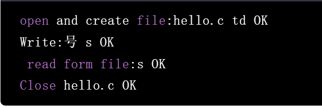

+ ### Master the standard I/O operation programming.
#### Master the use of fopen() function, fclose() function, fread() and fwrite() function through comprehensive examples, the reference code is as follows, enter the source code, compile and run, view the result in the terminal:
```
# include<stdio.h>
# include<unistd.h>
# include<fcntl.h>
# include<sys/stat.h>
# include<sys/types.h>
char buf1[] ="abcdefghij";
char buf2[] = "ABCDEFGHIJ";
void err_exit(char *err_s){
    perror(err_s);
    exit(1);
    }
        int main(void)
    {
    FILE *fp;
    if((fp = fopen("hole.file","w"))== NULL)
        err_exit("file open fail!");
    if(fwrite(buf1,sizeof(buf1),1,fp)!=1)
        err_exit("file write buf1 error!");
    if(fseek(fp,40,SEEK_SET)==-1)
        err_exit("fseek error!");
    if(fwrite(buf2,strlen(buf2),1,fp)!=1)
        err_exit("file write buf2 error!");
    fclose(fp);
}

```
#### Result example
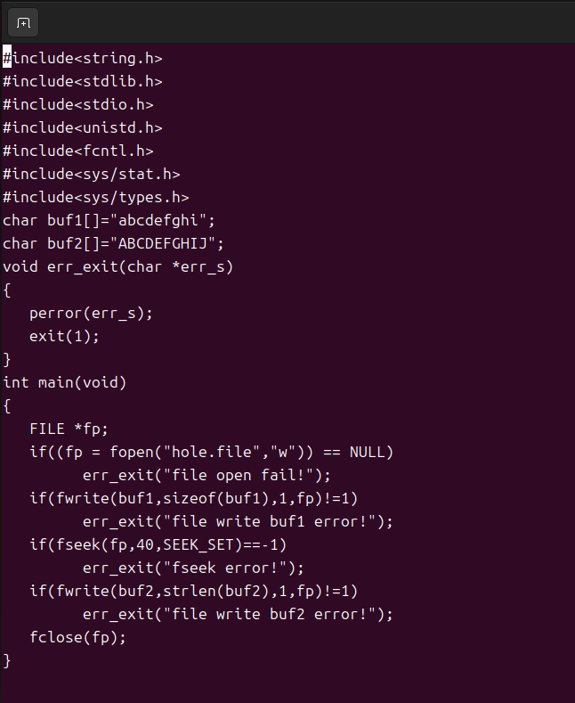
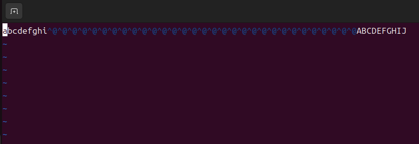


+ ### Create a child process.
#### Use fork function programming to create a child process, understand the process of execution of the parent process, the reference code is as follows, enter the source code, compile and run, view the results in the terminal.

#### Source code function: The parent process to create a child process, return after the father and son process respectively loop output string 6 times, after each output using sleep(5) delay 5s, and then enter the next loop
```
# include<stdio.h>
main(){
    int p,i;
    while((p= fork())==-1); //创建子进程直至成功
    if(p==0)
    //子进程返回
    {
        for(i=0;i<6;i++)
        {
            printf("Hello,this is a child process! ID= 8d \n",getpid());
            sleep(5); //延时5s
        }
    }
        //父进程返回
     else
    {
        for(i=0;i<6;i++)
        {
            printf("Hello,this is a parent process! ID= n",getpid());
            sleep(5); //延时5s
        }
    }
}

```
#### First, modify the above program, use exit() and wait() to realize the synchronization of the parent process, and its synchronization mode is the parent process

#### To synchronize the child process, that is, the child process loops output 6 times, and then the parent process loops output 6 times.
```
# include<stdio.h>
main()
{   int p,i;
    while((p= fork())==-1); //创建子进程直至成功
    if(p>0)//返回父进程
    {
    wait(0);
    //父进程等待子进程终止
    for(i=0;i<6;i++)
    {
        printf("Hello,this is a parent process! ID= n",getpid());
        sleep(5);
        //延时5s
    }
    }
    else
    {
        //返回子进程
        for(i=0;i<6;i++)
        {
            printf("Hello,this is a child process! ID= n",getpid());
            sleep(5);
        }
        exit(0);//子进程向父进程发终止信号
    }
}

```

#### Result example
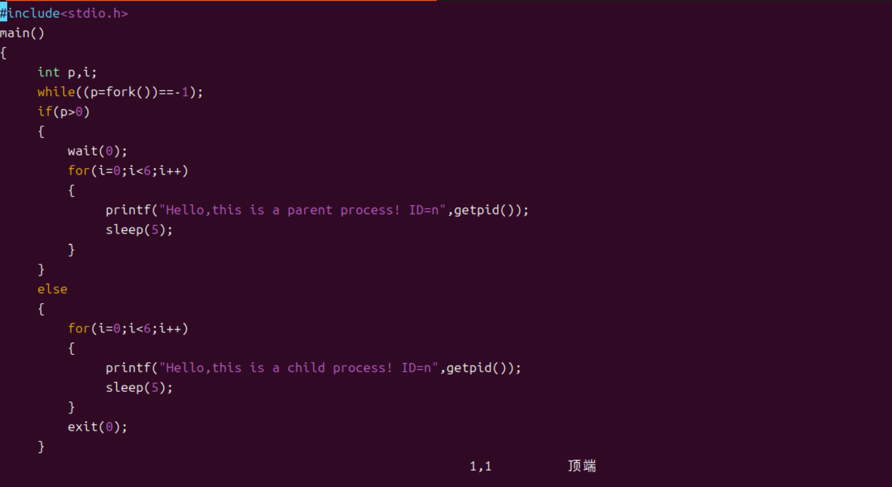
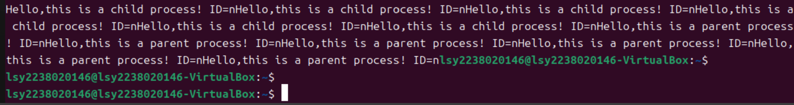

+ ### Master the use of exec() function family, exit() function and wait() function.
#### The reference code is as follows, enter the source code, compile and run it, and view the result in the terminal

#### Code function: through fork(), wait() and exit() to implement process creation, concurrency and synchronization; Create a child process with fork, which invokes exec() to start Shell command ps to view the current process information of the system.
```
# include<stdio.h>
# include<sys/types.h>
#include<unistd.h>
main(){
    pid_t pid;
    char * path="/bin/ps";char * argv[5]={"ps","-a","-x",NULL};
    printf("Run ps with execve by child process:\n");
    if((pid=fork())<0)
    {
        printf("fork error!");exit(0);
    }
    else if(pid==0)
    {
        if(execve(path,argv,0)<0)
        {
            printf("fork error!");
            exit(0);
        }
        printf("child is ok!\n");
        exit(0);
    }
    wait();
    printf("it is ok!\n");
    exit(0);
}

```

#### Result example：
```
#include <stdio.h>
#include <unistd.h>
#include <stdlib.h>
#include<sys/types.h>
#include <sys/wait.h>
main(void)
pid t pid =0;
int status;
pid = fork();
if(pid ==0)
printf("I am the child.");execl("/bin/ls","ls","-1"，"/home/ubuntu/",(char *)0);perror("In exec():");
if(pid >e)printf("I am the parent, and the child is %d.\n", pid);pid = wait(&status);printf("End of process %d:",pid);
if(WIFEXITED(status)){
printf("The process ended with exit(%d).\n",WEXITSTATUS(status));
if(WIFSIGNALED(status)){
printf("The process ended with kill -%d.\n", WTERMSIG(status));
if(pid<o){
perror("In fork():");
exit(0);
}
#include<stdio.h> // printf()
#include<stdlib.h>// exit()
#include<sys/types.h> // pid t                                           
 #include<sys/wait.h>//wait()                                                          
#include<unistd.h>// fork
int main(int argc, char **argv)
pid t pid;
pid = fork();
if(pid==0)
printf("It is the child process and pid is %d\n",getpid());
int i=0;
for(i=0;i<8;i++)
printf("%d\n",i);
exit(0);
else if(pid >8)
printf("It is the parent process and pid is %d\n",getpid());
int status;
wait(&status);
printf("child is reaped\n");
else
printf("Error in forking..\n");                                                                                                      
   exit(EXIT FAILURE)；                                                                                                                                        
}                                                                                                                                                      
   return 0；
 }
```

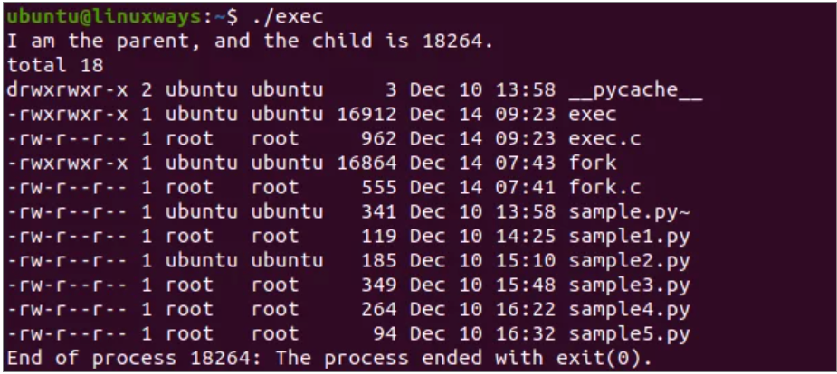
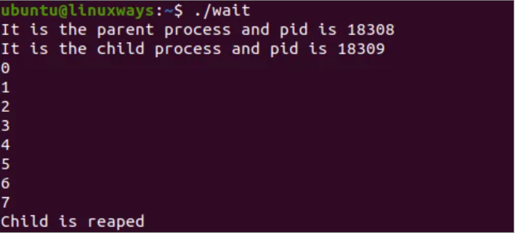

+ ### Master Zombie process writing.
#### The reference code is as follows, enter the source code, compile and run it, and view the result in the terminal.
```
# include<stdio.h>
# include<sys/types.h>
main()
{
    pid_t pid;
    pid= fork();
    if(p<0)
    //出错处理
        printf("error occurred");
    else if(p==0)
        exit(0);
    else
    {
        sleep(60);
        wait(NULL);
    }
}


```
#### Result example

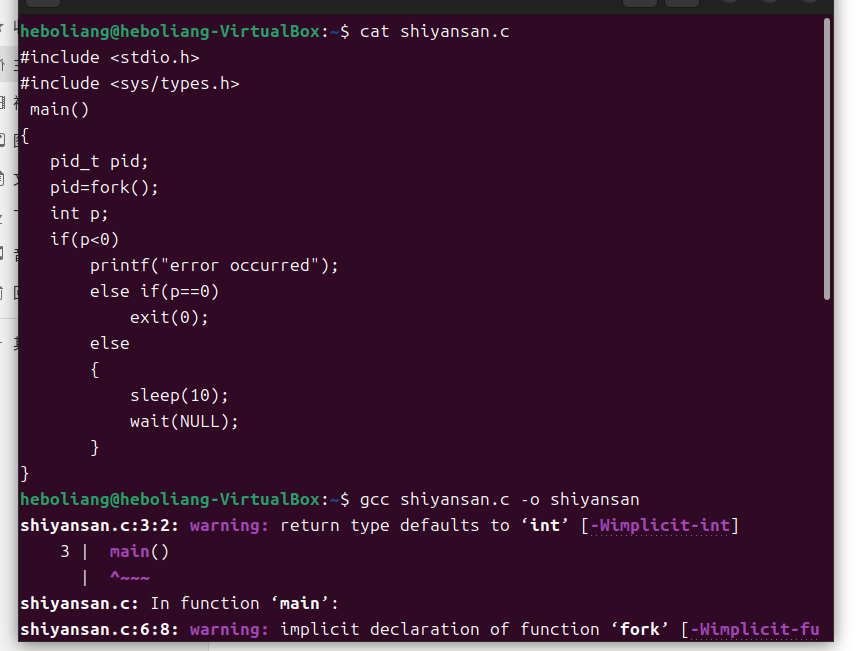
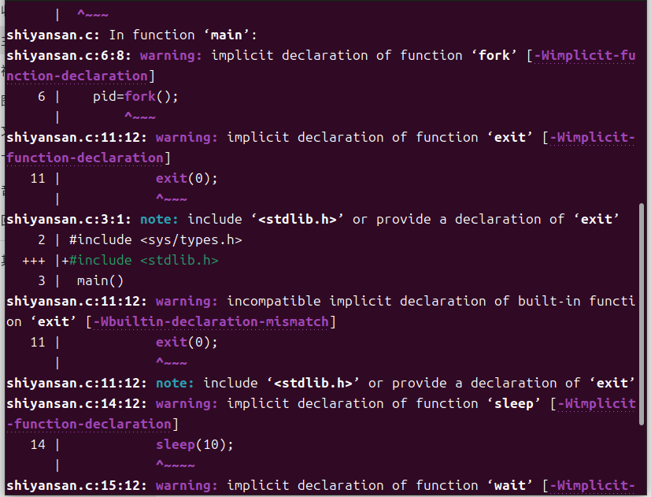
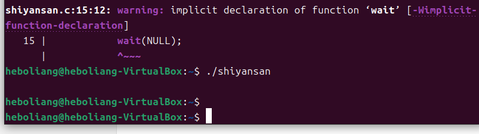

+ ### Thinking question
#### What is the difference between basic and standard I/O operations?
**_Solution:_** 

#### The fork function has several different return values, what is the meaning of each?
**_Solution:_** 

#### Programming implementation using the exec function to call the "ls-1" command.
**_Solution:_** 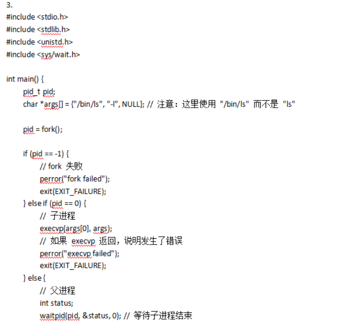
                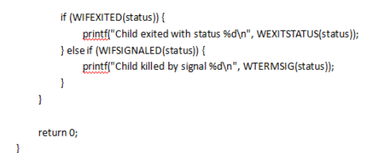

#### Search for a Zombie process on the Internet, debug and understand the program, and master the method of writing Zombie process.
**_Solution:_** 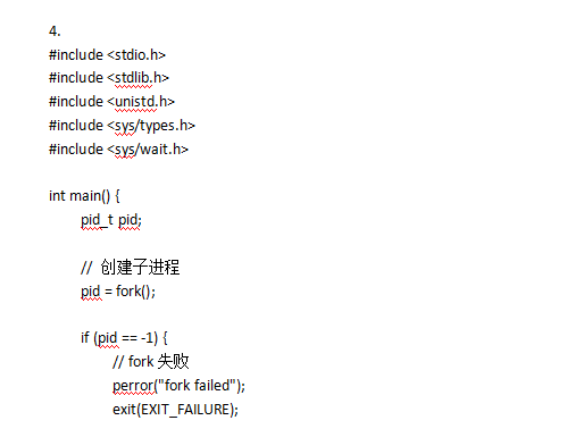
                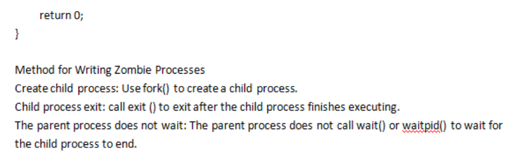
                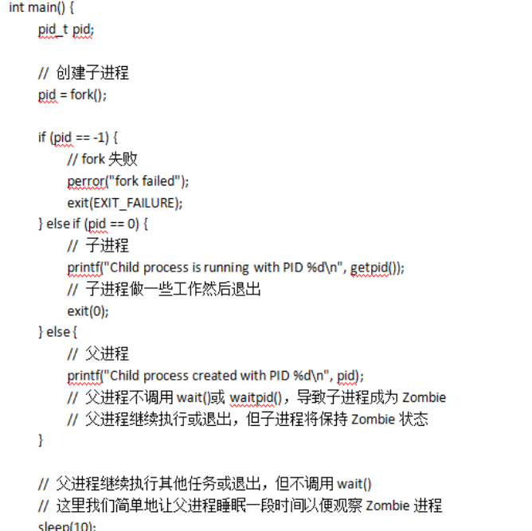

+ ### Division
#### 张静歌:Team Leader，Responsible for the construction of the warehouse, document writing, and organization of tasks
#### 周心怡:Responsible for mastering basic IO programming, as well as the corresponding part of code writing
#### 郭若晗:Responsible for mastering the standard IO operation programming, as well as the corresponding part of the code writing
#### 李圣炎:Responsible for creating sub-processes and writing corresponding codes
#### 唐新豪:Responsible for mastering the use of exec function family, exit function and wait function, as well as the corresponding part of the code writing
#### 赵浩宇:Responsible for mastering the writing of the Zombie process and the corresponding part of the code
#### 张地:Responsible for solving thinking questions
#### 张赛博:Two people are responsible for the recording of the video.
#### 刘明庆:Two people are responsible for the recording of the video.
#### 王佳慧:Help everyone and perfect the details

