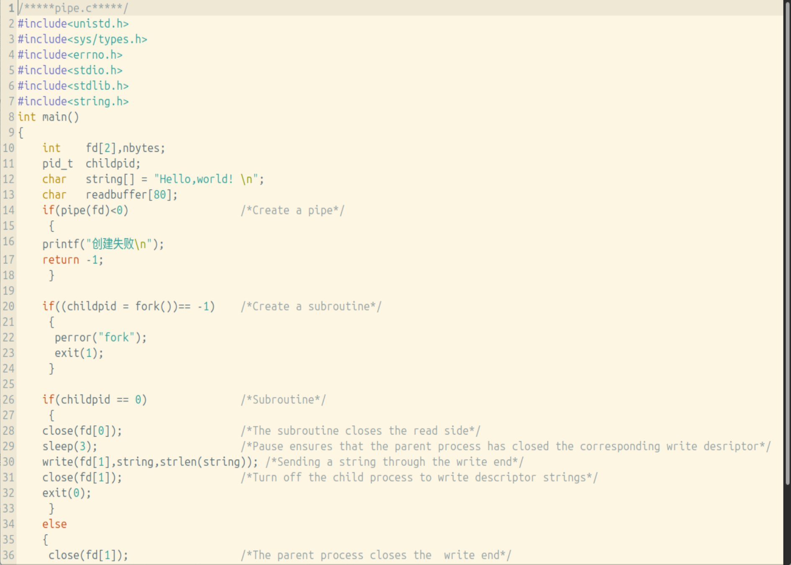
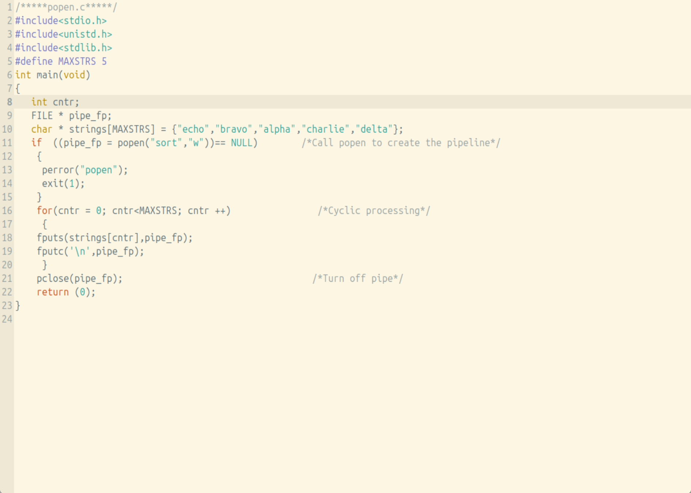
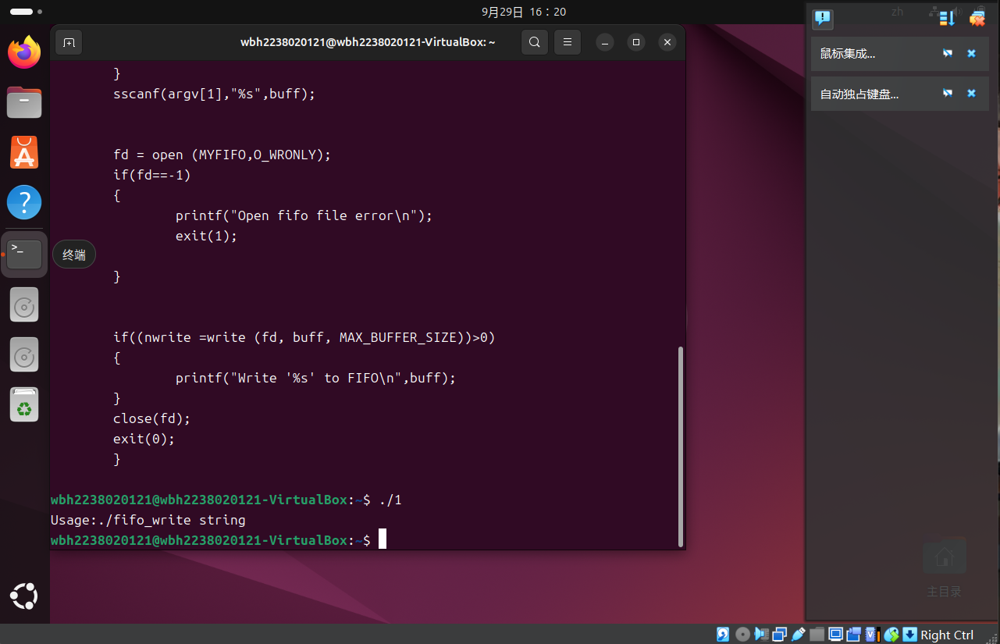
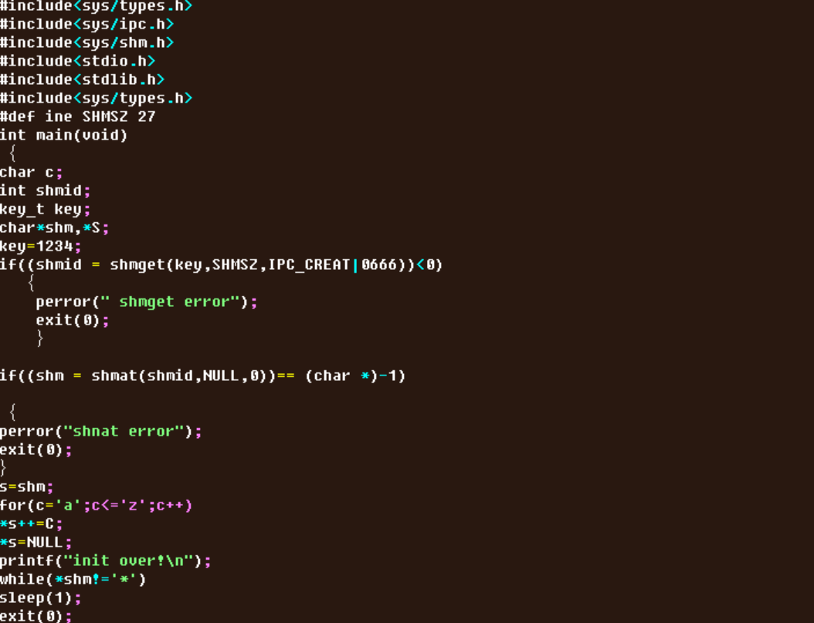
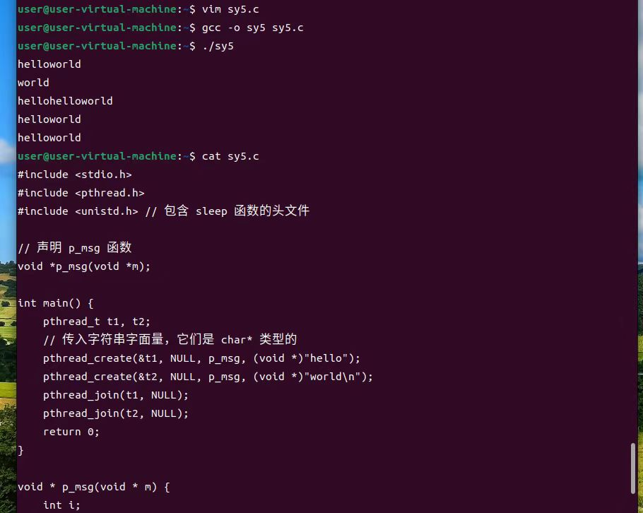
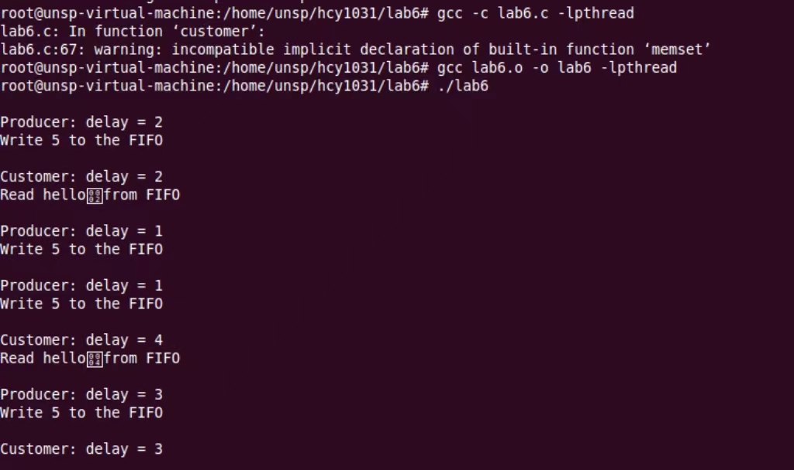

# experiment-4 Process communication and multi-threaded programming
# Experimental purpose
  Master the writing of process communication and synchronization programs.

  Master multi-threaded programming technology.
# Experimental equipment
  Hardware: PC.

  Software: VirtualBox virtual machine and Ubuntu operating system.

# Experiment preview requirements
  Read the content in section 2.9.

  Read section 2.10.
# Experimental content
  Master pipeline communication programming technology.

  Master shared memory communication programming technology.

  Master multi-threaded programming technology.

  Using multithreading technology to solve the "producer consumer" problem.
# Experimental procedure
   1. Master pipeline communication programming technology

  (1)  Write programs to create, read/write and close the pipeline, and realize the data exchange between the parent and child processes through the pipeline

   

   .png)

   .png)

  (2)  Understand the use of standard flow pipes

   

   .png)

  (3)  Write programs to implement the functionality of named pipes

  

  .png)

  .png)

  .png)

  2. Master shared memory communication programming technology

  (1) Programming to realize the exchange of data between two processes by sharing memory, mainly using functions such as  shget(), shmat(), shmdt() and shmctl()

  

  .png)

  3. (1) Master multi-threaded programming technology

  

  .jpg)

  5. Using multithreading technology to solve the "producer consumer" problem

  (1) The program reads five letters per person, prints once, clears the cache, and loops until Y.

  

  .jpg)

# Think about the question
 (1) The use of pipeline programming to achieve the parent process write data, child process read data function.

 (2) Can communication between two unrelated processes be achieved through anonymous channels? Why?

 (3) What are the other ways of inter-process communication? Search the relevant source code on the Internet, debug and understand.

# Group division of labor
  1. Cui Pengju, ZHENG Keyuan, MA Bingyu, LIU Qiyue    1.1 1.2
     
  2. Wu Binghan, WU Hao, HE YuHAO                      1.3 2.1
     
  3. Wang Yihan, Cheng Yu, YAN Xuejie                  3.1 4.1

