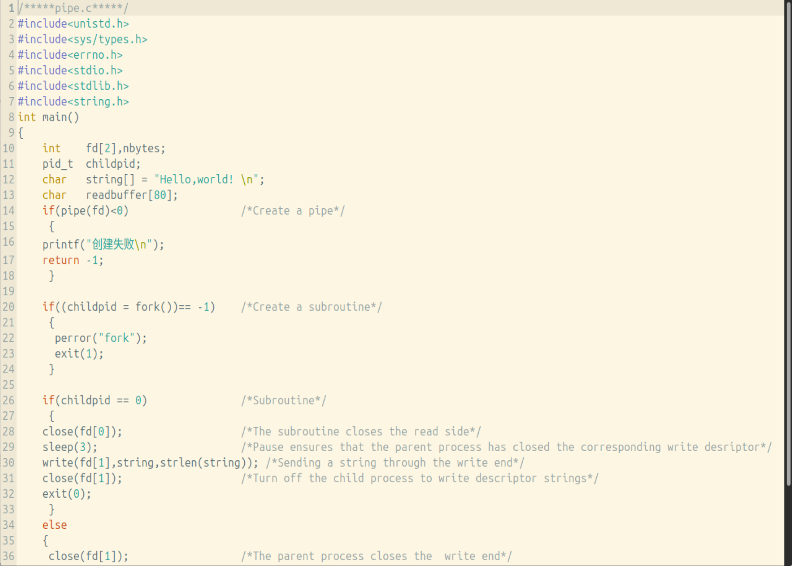
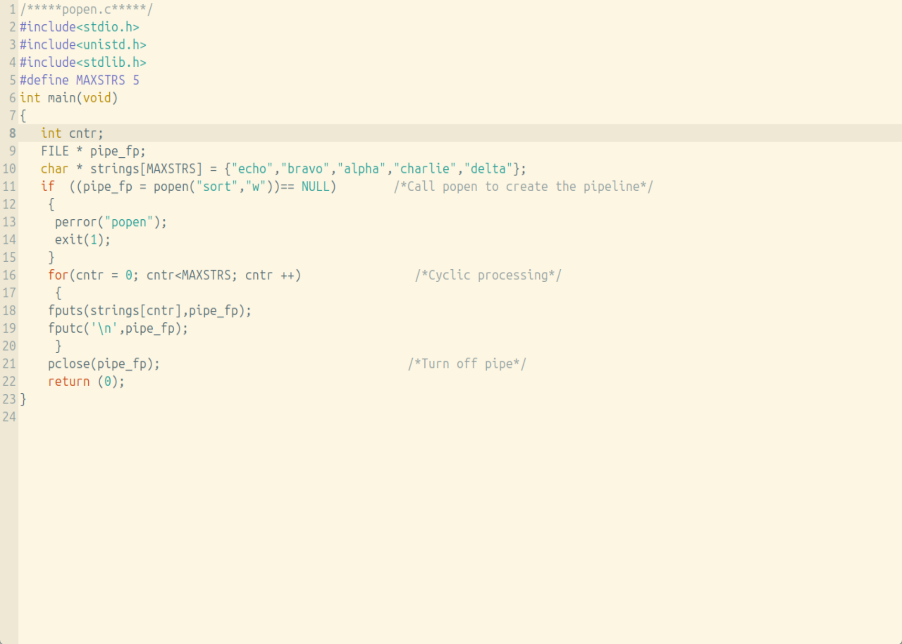
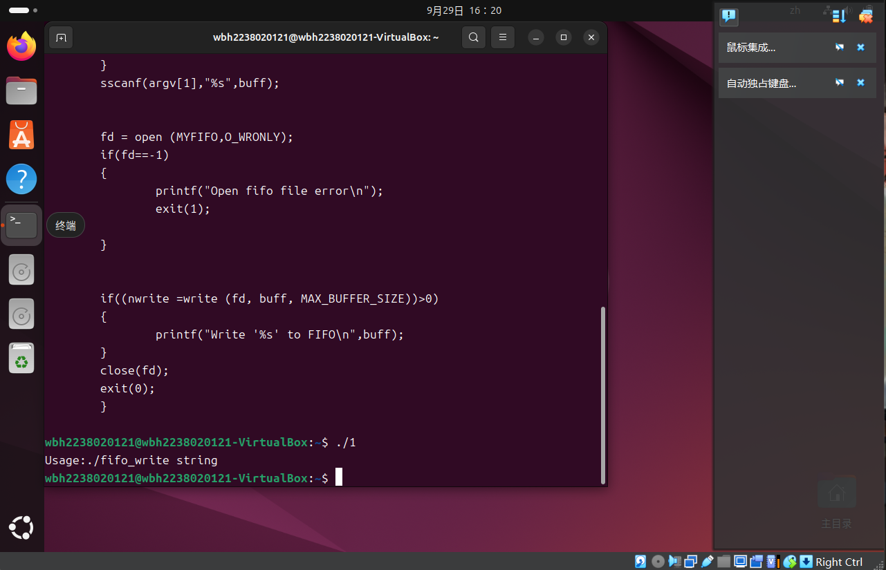
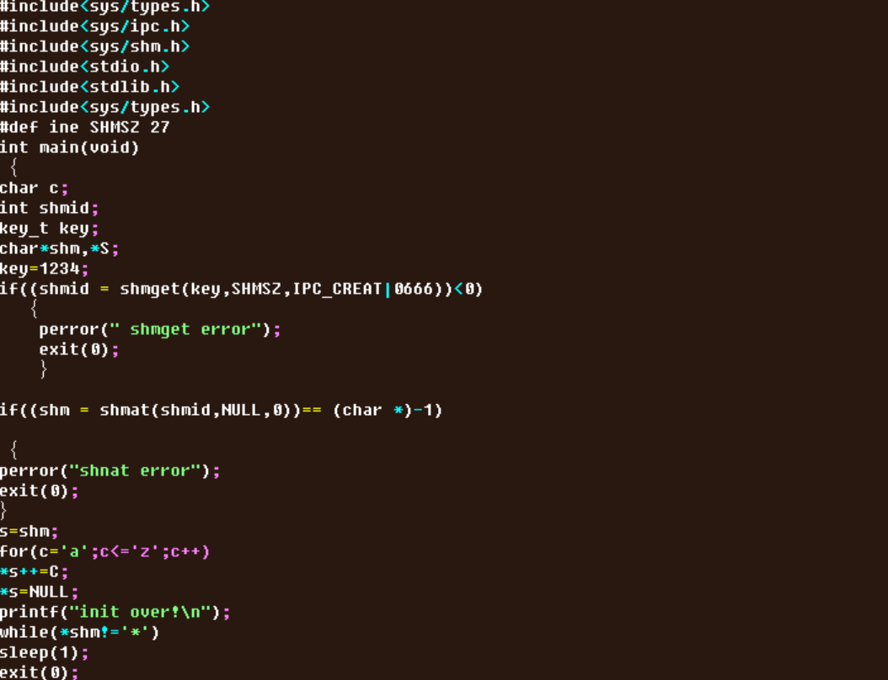
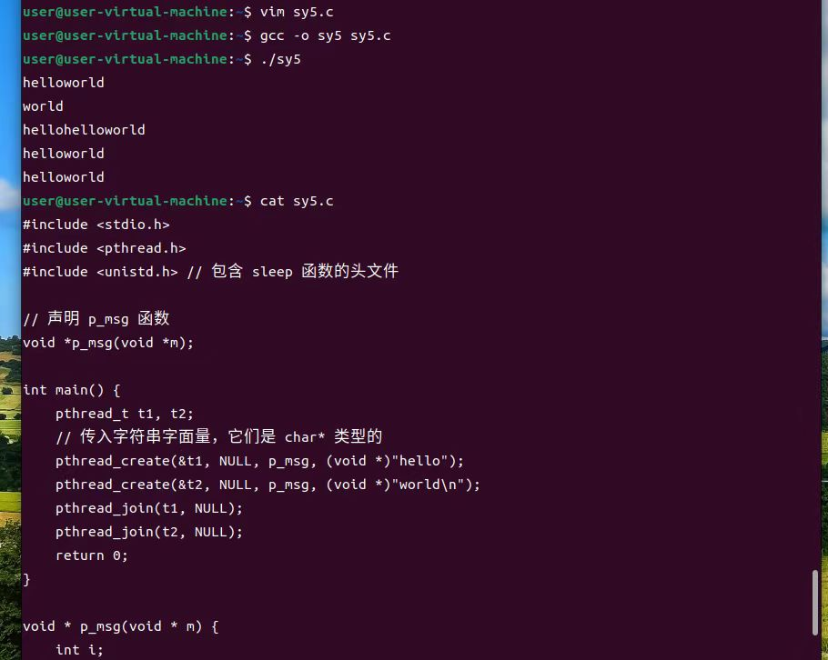
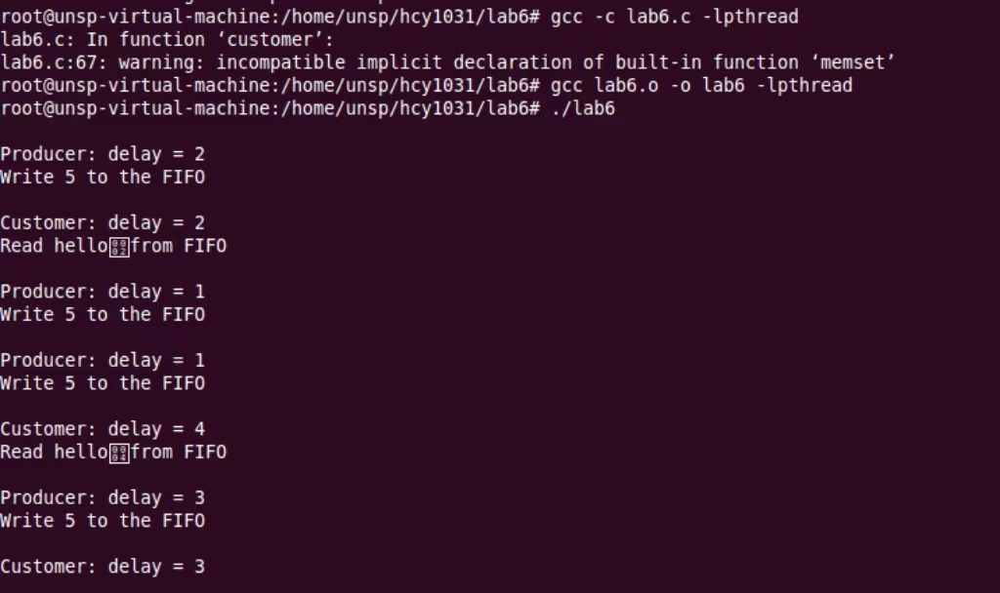

# experiment-4 进程通信和多线程编程

# 实验目的

  掌握进程通信和同步程序的编写。

  掌握多线程编程技术。

# 实验设备

  硬件：PC。

  软件：VirtualBox虚拟机和Ubuntu操作系统。

# 实验预习要求

  阅读第2.9节的内容。

  阅读第2.10节。

# 实验内容

  掌握管道通信编程技术。

  掌握共享内存通信编程技术。

  掌握多线程编程技术。

  使用多线程技术解决“生产者消费者”问题。

# 实验步骤

      1. 掌握管道通信编程技术

  (1)  编写程序创建、读/写并关闭管道，实现父子进程之间通过管道的数据交换

   

   .png)

   .png)

  (2)  了解标准流管道的使用

   

   .png)

  (3)  编写程序实现命名管道的功能

  

  .png)

  .png)

  .png)

    2. 掌握共享内存通信编程技术

  (1) 通过共享内存实现两个进程之间的数据交换，主要使用shget()、shmat()、shmdt()和shmctl()等函数

  

  .png)

    3. (1) 掌握多线程编程技术

  

  .jpg)

    5. 使用多线程技术解决“生产者消费者”问题

  (1) 程序每人读取五个字母，打印一次，清空缓存，循环直到Y。

  

  .jpg)

# 思考题

 (1) 使用管道编程实现父进程写数据、子进程读数据的功能。

 (2) 能否通过匿名通道实现两个不相关进程之间的通信？为什么？

 (3) 进程间通信的其他方式有哪些？请在网上搜索相关源代码，调试并理解。

# 小组分工

    1. 崔鹏举，郑轲元，马炳宇，刘启越    1.1 1.2
    
    2. 吴炳翰，吴昊，贺昱豪                1.3 2.1
    
    3. 王一涵，程煜，闫雪洁                3.1 4.1
