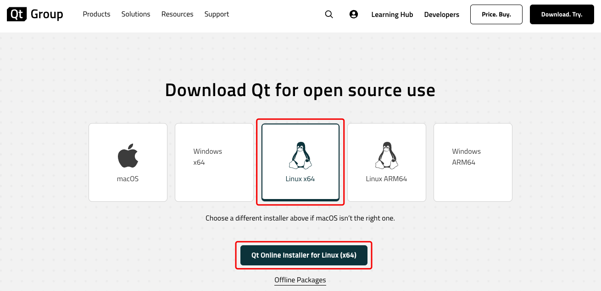
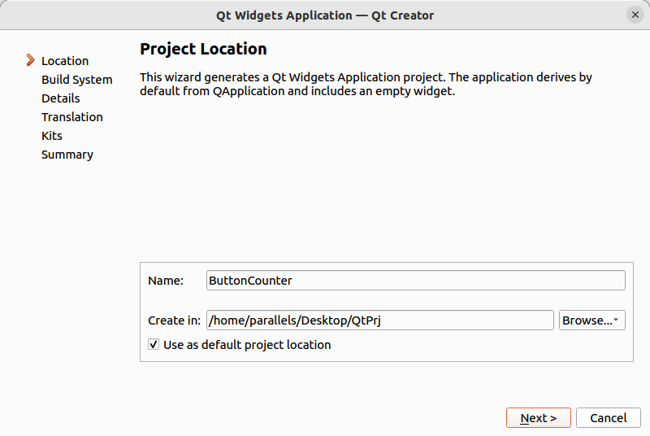
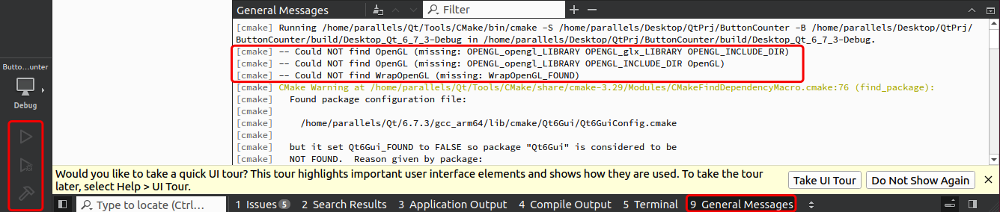

# Embedded Linux Lab 6

## Purpose

- Become familiar with the use of the Qt Creator development environment.
- Learn how to create a basic GUI application in Qt.
- Understand the working principle of Qt's signal and slot mechanism.
- Implement a simple counter application, where the counter increments each time a button is clicked.

## Lab Environment

1. **Qt Version**: Qt Creator 6.8.0
2. **Operating System**: Ubuntu 22.04.2

## Installing Qt

Open this link in your Ubuntu system browser: [Qt Online Installer](https://www.qt.io/download-qt-installer-oss?hsCtaTracking=99d9dd4f-5681-48d2-b096-470725510d34|074ddad0-fdef-4e53-8aa8-5e8a876d6ab4).

If the webpage is unresponsive, consider using **VPN** for access.

Select **Linux x64** and download the installer.



Locate the downloaded file, open a terminal, and enter `chmod +x` followed by dragging the file into the terminal. Press Enter to grant the file **executable permissions**.


You will need to register for a Qt account on the [Qt official website](https://www.qt.io/). Return to the Qt installer, input your account credentials, and click next.


Check the appropriate boxes, and continue to click next.


You can choose **not to send statistical data** to Qt, then click next.


Choose **Desktop Development**, then click next.


Agree to the terms, click next, and then the installer will start downloading and installing. If any issues arise during the download, retry as needed.


Once the installation is complete, find **Qt Creator** in the application menu and open it.


> **If the following screen appears**, it indicates that dependencies are needed to run Qt.
>
> 
>
> In the **terminal**, enter the following command to install the required packages, then restart Qt Creator.
>
> ```bash
> sudo apt install libxcb-cursor0
> ```

## Creating a Project

First, open Qt Creator and follow the steps below to create a new Qt Widgets application:

1. In Qt Creator, click “File” -> “New File or Project”.

   

2. In the window that pops up, select "Qt Widgets Application" under "Applications".

   

3. Set the project name, for example, “ButtonCounter,” and choose a location to save the project.

   

4. **For the subsequent selection pages, keep the default settings**, and continue to click "Next" until the project is created.

Once the project is created, Qt will automatically generate several important files, including:

- **main.cpp**: The entry point of the program.
- **mainwindow.ui**: The UI design file for the main window.
- **mainwindow.h** and **mainwindow.cpp**: The header and implementation files for the main window class.


## Designing the User Interface


Open `mainwindow.ui` to enter Qt’s visual UI designer. Follow these steps to design the interface:

1. From the “Widget Box” on the left, drag a **Push Button** to the central area and set the button’s `text` property to "ClickMe!".

   

2. Drag a **Label** to display the click count, with default text set to "Number: 0".

   

3. Adjust the positions and sizes of the button and label to ensure a reasonable layout.

After completing the design, remember to save the UI design (Ctrl+S).

## Explanation of the Signal and Slot Mechanism

In Qt programming, the **signal and slot mechanism** is a flexible system for passing information between objects. The key feature is **decoupling**; the signal emitter does not need to know who the receiver is or how the signal is processed.

### Why Not Direct Manipulation?

In many cases, we want different objects to remain independent of each other. For example, suppose you are developing a complex application where button clicks trigger many different actions: some update the UI, some save data, and others send notifications. If each button directly controlled these actions, the code would become very complex and difficult to maintain.

The purpose of the signal and slot mechanism is to **simplify communication**, allowing objects to interact through signals without directly manipulating each other. The signal simply informs the system of an event, and the system passes this signal to the appropriate handler (slot).

### Appropriate Analogy

Imagine waiting for your flight at an airport. The airport’s announcement system acts as a “signal” broadcaster. Each passenger is like a “slot,” receiving information and acting accordingly (e.g., boarding the plane).

Key points:

- The **announcement system (signal)** does not need to know each passenger’s specific details. It just broadcasts the message.
- **Passengers (slots)** react to the message by taking their own actions, such as heading to the boarding gate or continuing to wait.

This is similar to how the signal and slot mechanism works: signals only send messages, and how those messages are processed is decided by the slots. The relationship between signals and slots can be many-to-many: one signal can be connected to multiple slots, and multiple signals can be connected to the same slot.

### Advantages of Signals and Slots

1. **Flexibility**: Signals and slots make the program more flexible, allowing signals and slots to be dynamically connected and disconnected during runtime.
2. **Decoupling**: The object sending the signal does not need to know the internal details of the receiver; it just emits the signal, which is handled by the slot.
3. **Scalability**: By using signals and slots, you can easily add new features to the program without modifying existing code.

## Implementing Signal and Slot Connection

### Defining the Counter Variable in the Header File

Open `mainwindow.h` and add an integer member variable `clickCount` in the private section of the main window class to store the number of button clicks:

```cpp
private:
    int clickCount;  // Counter variable
```


### Initializing the Counter

In the `mainwindow.cpp` constructor, initialize the counter variable:

```cpp
MainWindow::MainWindow(QWidget *parent)
    : QMainWindow(parent)
    , ui(new Ui::MainWindow)
    , clickCount(0)  // Initialize click count
{
    ui->setupUi(this);
}
```

The red text in the image below indicates the modified lines:


### Writing the Slot Function

Next, write a slot function in `mainwindow.cpp` that triggers when the button is clicked, increments the counter, and updates the label:

```cpp
void MainWindow::on_pushButton_clicked()
{
    clickCount++;  // Increment the click count
    ui->label->setText("Number: " + QString::number(clickCount));  // Update the label display
}
```


After writing the code, save the changes with Ctrl+S.

### Connecting Signals and Slots

In Qt Designer, you can right-click the button, choose “Go to Slot,” and then select the `clicked()` signal. Qt will automatically generate the slot function declaration in the code.


Alternatively, if you prefer to connect signals and slots manually, you can use the following code in the constructor:

```cpp
connect(ui->pushButton, &QPushButton::clicked, this, &MainWindow::on_pushButton_clicked);
```

This code specifies that when the button is clicked, the `clicked()` signal is emitted, and the `on_pushButton_clicked()` slot function is executed.

## Compiling and Running the Project

Qt Creator will automatically configure CMake, so there is no need for manual configuration. In the author's case, the run and debug buttons in the bottom left of Creator were grayed out.

**If your buttons are active**, you do not need to troubleshoot CMake configuration errors.

> Upon inspection, it was discovered that some OpenGL-related libraries required by Qt6’s Qt6Gui and Qt6Widgets components were missing in Ubuntu.
>
> 
>
> To install these libraries, execute the following command in the terminal:
>
> ```bash
> sudo apt install libgl1-mesa-dev libglu1-mesa-dev freeglut3-dev
> ```
>
> After installation, restart the appropriate services and press `1 2 3 4` followed by Enter.
>
> Reopen Qt, open the project, and select the CMake file. Qt Creator will automatically configure CMake, and the three buttons will become active.
>
> 

Click the “Run” button, and Qt Creator will compile the project and launch the application. As you click the button, the label will update to reflect the new click count.


## Experiment Extension

### Image Switcher

Click the button to cycle through and display different images.

### Slider and Progress Bar Synchronization

The value of the slider is reflected in the progress bar, updating in real time as the slider moves.

### Popup Dialog

Click the button to display a message box or confirmation dialog.

### Checkbox-Enabled Button

When the checkbox is selected, the button is enabled; when unchecked, the button is disabled.

## Group Collaboration

| Name | Installed Ubuntu | Git Collaboration | Markdown Syntax | Linux Basics | Qt Installation | Signals and Slots | Extension |
| ---- | ---------------- | ----------------- | --------------- | ------------ | --------------- | ----------------- | --------- |
|      |                  |                   |                 |              |                 |                   |           |
|      |                  |                   |                 |              |                 |                   |           |
|      |                  |                   |                 |              |                 |                   |           |
