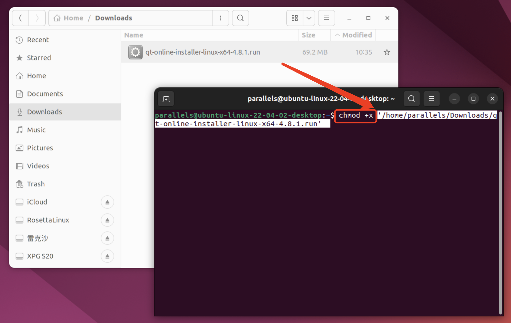
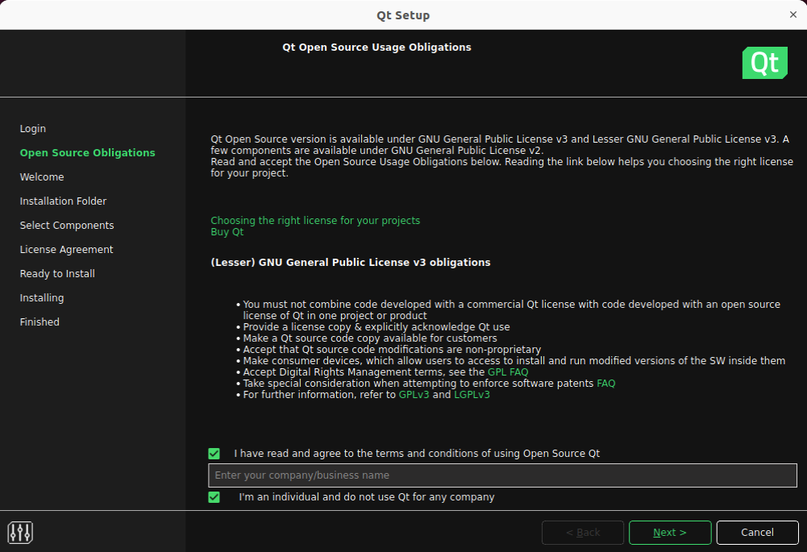
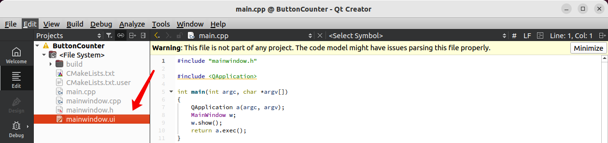
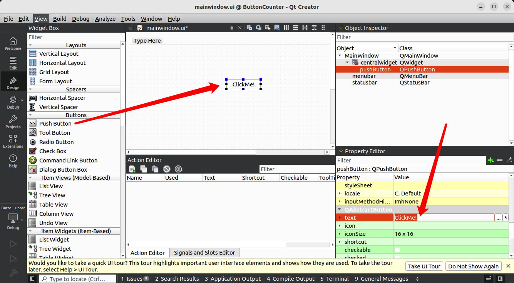
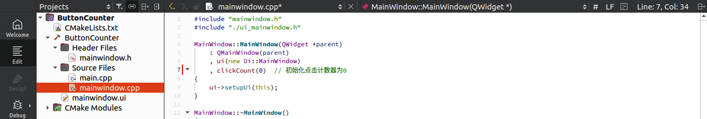
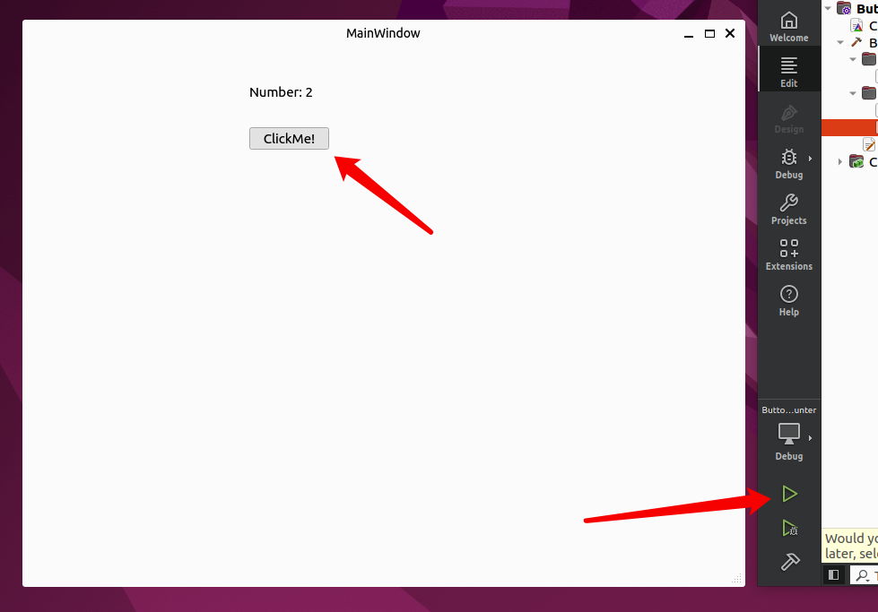
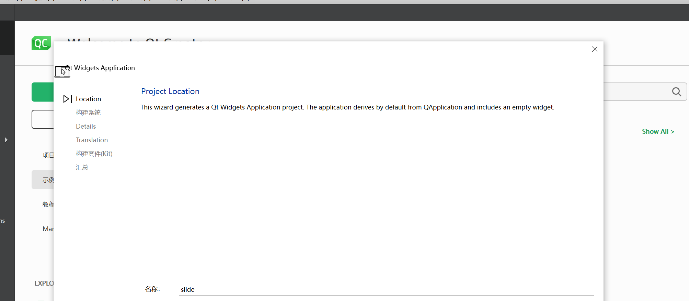
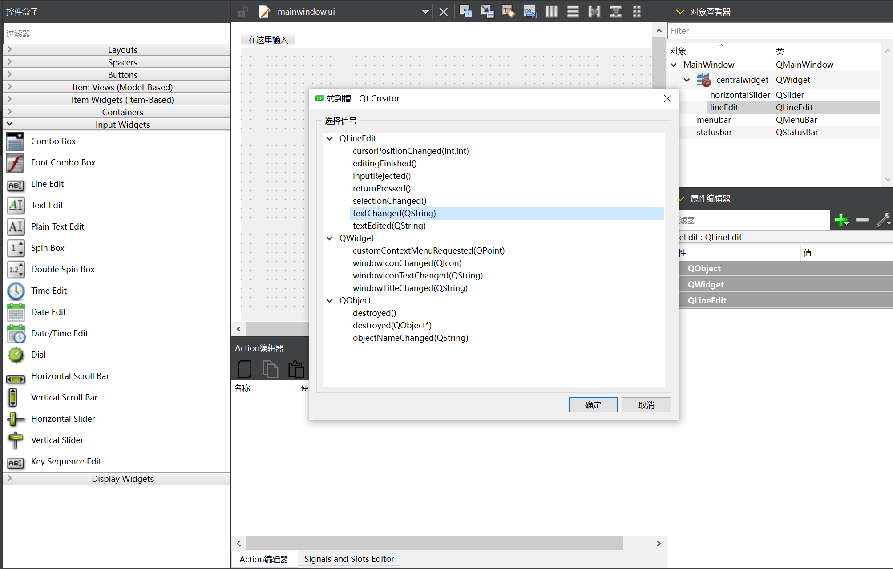
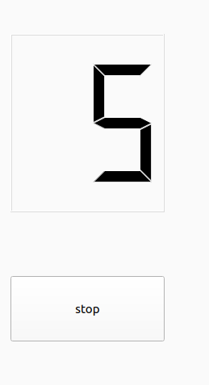

# 嵌入式Linux 实验六

# 实验目的

- 熟悉Qt Creator开发环境的使用。
- 学习如何在Qt中创建一个基本的GUI应用程序。
- 理解Qt信号与槽机制的工作原理。
- 实现一个基本的计数器应用程序，按钮每次点击时，计数器加一。

# 实验环境准备

1. **Qt版本**：Qt Creator 6.8.0
2. **操作系统**：Ubuntu 22.04.2

# 视频教程

[嵌入式Linux Qt开发：信号与槽 Linux实验课](https://www.bilibili.com/video/BV1kb1oYJEnL?vd_source=96f5a31680137ac4bd3f08e085e51241)

[实验发挥部分：图片切换器](https://tingwu.aliyun.com/doc/transcripts/p7g39572kw86qz65?sl=1#)

# 安装Qt

在Ubuntu系统的浏览器打开这个链接：[Qt在线安装器](https://www.qt.io/download-qt-installer-oss?hsCtaTracking=99d9dd4f-5681-48d2-b096-470725510d34|074ddad0-fdef-4e53-8aa8-5e8a876d6ab4)

如果网页无响应可以**科学上网**。

选择**Linux x64**并下载。


找到下载的文件，打开终端输入`chmod +x  `后拖入文件，回车后即可为该文件添加**可执行权限**。



需要你在[Qt官网](https://www.qt.io/)中完成Qt账号的注册。返回Qt安装程序，输入账号密码，点击下一步。


该勾选的勾选上，下一步后继续下一步。



可选择**不发送统计信息**到Qt，下一步。


选择**为桌面开发**，下一步。


同意协议后下一步，点击安装即出现下载安装界面。国内也是可以正常下载的，如果有下载问题可点击重试。


安装完成后，在左下角应用里找到**Qt Creator**并打开。


> **如果显示下述界面**，则提示运行Qt需要安装依赖项。
>
> 
>
> 在**终端**输入安装指令并回车，安装完成后打开Qt Creator即可。
>
> ```bash
> sudo apt install libxcb-cursor0
> ```

# 创建项目

首先，打开Qt Creator，按照以下步骤创建一个新的Qt Widgets应用程序：

1. 在Qt Creator中点击“文件” -> “新建项目”。

   

2. 在弹出的窗口中，选择“应用程序”下的“Qt Widgets Application”。

   

3. 设置项目名称，例如“ButtonCounter”，并选择保存路径。

   

4. **后续的选择页面保持默认**即可，继续点击“下一步”直到项目创建完成。

创建项目后，Qt会自动生成几个重要的文件，包括：

- **main.cpp**：程序入口文件。
- **mainwindow.ui**：主窗口的UI设计文件。
- **mainwindow.h** 和 **mainwindow.cpp**：主窗口类的头文件和实现文件。


# 设计用户界面



打开`mainwindow.ui`，进入Qt的可视化UI设计器，按以下步骤设计界面：

1. 从左侧的“Widget Box”中拖拽一个**Push Button**到中央界面，并将按钮的`text`属性设置为“ClickMe!”。

   

2. 再拖拽一个**Label**用于显示点击次数，默认显示文本为“Number: 0”。

   

3. 调整按钮和标签的位置和大小，以确保布局合理。

设计完成后，记得保存UI设计（Ctrl+S）。

# 信号与槽机制的解读

在Qt编程中，**信号与槽机制**是用于在对象之间传递信息的一种灵活机制。它的关键作用在于**解耦合**，即发出信号的一方不需要知道接收方是谁，也不需要关心它如何处理这个信号。

### 为什么不直接操作？

在很多情况下，我们希望不同的对象之间能保持独立性。例如，假设你在开发一个复杂的应用程序，按钮的点击需要触发很多不同的操作：有的更新界面，有的保存数据，有的发送通知。如果每个按钮都直接控制这些操作，会让代码变得非常复杂和难以维护。

信号与槽机制的目的就是**简化通信流程**，让对象之间不用直接互相操作，而是通过信号的形式告诉系统“发生了什么事”，由系统将这个信号传递给相应的处理函数（槽）。

### 合适的例子

想象一下你在机场等飞机。机场有一个广播系统，负责通知乘客航班信息。这个广播系统可以理解为“信号”的发射者。机场的每位乘客就像是“槽”，接收这些信息并根据通知采取行动（例如：登机）。

这里的关键在于：

- **广播系统（信号）** 并不需要了解每个乘客的具体情况。它只负责发出消息。
- **乘客（槽）** 根据收到的信息自行决定要做什么，比如去登机口、继续等候等。

这个例子和信号与槽机制类似：信号只负责传递消息，至于消息由哪个对象接收、如何处理，完全是由槽来决定的。信号和槽之间可以是多对多的关系：一个信号可以连接多个槽，多个信号也可以连接同一个槽。

### 信号与槽的优势

1. **灵活性**：信号与槽使得程序各部分更加灵活，可以根据需要在运行时动态连接和断开信号与槽。
2. **解耦合**：发送信号的对象不需要了解接收者的内部细节，只需发出信号，由接收者（槽）处理。
3. **可扩展性**：通过信号与槽，程序可以轻松地添加新功能，而无需修改已有的代码。

# 实现信号与槽连接

## 在头文件中定义计数器变量

打开`mainwindow.h`，在主窗口类的私有部分添加一个整数类型的成员变量`clickCount`，用于存储按钮的点击次数：

```cpp
private:
    int clickCount;  // 计数器变量
```


## 初始化计数器

在`mainwindow.cpp`的构造函数中初始化计数器变量：

```cpp
MainWindow::MainWindow(QWidget *parent)
    : QMainWindow(parent)
    , ui(new Ui::MainWindow)
    , clickCount(0)  // 初始化点击次数
{
    ui->setupUi(this);
}
```

下图中红色为修改行：



## 编写槽函数

接下来，在`mainwindow.cpp`中编写槽函数，当按钮被点击时触发，更新计数并显示在标签中：

```cpp
void MainWindow::on_pushButton_clicked()
{
    clickCount++;  // 点击次数加1
    ui->label->setText("Number: " + QString::number(clickCount));  // 更新标签显示
}
```


完成代码编写后，Ctrl+S保存变更。

## 连接信号与槽

在Qt Designer中，你可以右键点击按钮，选择“转到槽”，然后选择`clicked()`信号，Qt会自动在代码中生成槽函数的声明。


当然，如果你想手动连接信号与槽，也可以在构造函数中使用以下代码：

```cpp
connect(ui->pushButton, &QPushButton::clicked, this, &MainWindow::on_pushButton_clicked);
```

这段代码表示，当按钮被点击时，`clicked()`信号被触发，继而执行`on_pushButton_clicked()`槽函数。

# 编译与运行项目

Qt Creator会自动配置Cmake，无需手动编写。笔者的Creator左下角的运行调试编译的按钮是灰色的。

**如果你的按钮是彩色的，则不需要排查Cmake配置错误的操作。**

> 查看报错信息发现我的Ubuntu缺少OpenGL相关的库，而这些库是Qt6的Qt6Gui和Qt6Widgets组件的依赖项。
>
> 
>
> 在终端执行：
>
> ```bash
> sudo apt install libgl1-mesa-dev libglu1-mesa-dev freeglut3-dev
> ```
>
> 安装完成后重启相应服务，输入`1 2 3 4`并回车。
>
> 重新打开Qt，打开文件或工程，选择项目的Cmake文件，此时Creator会自动配置Cmake，三个按钮已经变成彩色。
>
> 

点击“运行”按钮，Qt Creator会编译项目并启动应用程序。点击按钮时，标签中的点击次数会随着按钮点击而更新。



# 实验发挥部分
## 图片切换器

点击按钮，依次切换显示不同的图片。

### 1. 创建项目

首先，创建一个文件夹以存放项目文件。

接着，打开 Qt Creator，按照以下步骤创建一个新的 Qt Widgets 应用程序：

1. 在 Qt Creator 中点击“文件” -> “新建项目”。
2. 在弹出的窗口中，选择“应用程序”下的“Qt Widgets Application”。
3. 设置项目名称，例如“PictureSwitcher”，选择保存路径为刚创建的文件夹，一直点击“下一步”直到完成项目创建。

   

4. 将需要切换的图片放在一个文件夹中，分别命名为 1.jpg、2.jpg……，并将该文件夹移动到项目目录中。

### 2. 设计用户界面

打开 `mainwindow.ui` 文件，进入 Qt 的可视化 UI 设计器，按以下步骤设计界面：

1. 从左侧的“Widget Box”中拖拽两个**按钮（Push Button）**到界面中央，分别将按钮的 `text` 属性设置为“Previous”和“Next”，表示前一张和下一张图片。同时，将它们的 **ObjectName** 分别设置为“btnPrev”和“btnNext”，方便后续代码定义与引用。

   

2. 再拖拽一个**标签（Label）**，用于显示图片，默认的文本可以删除。

3. 调整按钮和标签的位置和大小，以确保界面布局合理。

   

设计完成后，记得保存（Ctrl+S）。

### 3. 实现信号与槽连接

#### 在头文件中定义变量

打开 `mainwindow.h` 文件，添加 QLabel 和 QPushButton 的定义：

```cpp
#include <QLabel>
#include <QPushButton>
```

在类定义中添加槽函数、QLabel 和 QPushButton 的定义：

```cpp
private slots:
    void btnPrev_clicked(); // 点击“Previous”按钮的槽函数
    void btnNext_clicked(); // 点击“Next”按钮的槽函数

private:
    Ui::MainWindow *ui;
    QLabel *label; // 用于显示图片的标签
    QPushButton *btnPrev; // “Previous”按钮
    QPushButton *btnNext; // “Next”按钮
    int currentImageIndex; // 当前显示图片的索引
    void showImage(int index); // 显示图片的函数
```

#### 图片资源导入

在项目的左侧侧边栏中，右键点击项目名称**PictureSwitcher**，选择“添加新文件”-->“Qt”-->“Qt Resources File”，文件名可以任意命名，例如“Image”。


加载资源文件后，左侧会出现一个**资源文件夹**，下附有**Image.qrc**文件，右键点击“资源”-->“添加现有文件”，选择要添加的图片文件。确保这些图片文件已经放在项目目录的文件夹中。


#### 初始化

在 `mainwindow.cpp` 构造函数中初始化变量：

```cpp
MainWindow::MainWindow(QWidget *parent)
    : QMainWindow(parent)
    , ui(new Ui::MainWindow)
    , currentImageIndex(0)  // 从第一张图片开始
{
    ui->setupUi(this);
    label = ui->label; // 设置 QLabel 变量
    btnPrev = ui->btnPrev; // 设置“Previous”按钮变量
    btnNext = ui->btnNext; // 设置“Next”按钮变量

    // 连接按钮与槽函数
    connect(btnPrev, &QPushButton::clicked, this, &MainWindow::btnPrev_clicked);
    connect(btnNext, &QPushButton::clicked, this, &MainWindow::btnNext_clicked);

    showImage(currentImageIndex); // 初始化显示第一张图片
}
```

红色为修改行：


#### 编写槽函数

接下来，在 `mainwindow.cpp` 文件中编写槽函数，当按钮被点击时，切换图片：

```cpp
void MainWindow::btnPrev_clicked()
{
    // 当前索引减1，如果小于0，则变为最后一张图片的索引
    currentImageIndex = (currentImageIndex > 0) ? currentImageIndex - 1 : 2;
    showImage(currentImageIndex);
}

void MainWindow::btnNext_clicked()
{
    // 当前索引加1，如果大于最后一张图片的索引，则变为0
    currentImageIndex = (currentImageIndex < 2) ? currentImageIndex + 1 : 0;
    showImage(currentImageIndex);
}

void MainWindow::showImage(int index)
{
    // 构建图片路径
    QString imagePath = QString(":/picSwitch/%1.jpg").arg(index + 1); // “:/picSwitch/%1.jpg”为图片路径
    qDebug() << "加载图片:" << imagePath;
    QPixmap pixmap(imagePath); // 加载图片
    if (!pixmap.isNull()) {
        // 调整图片大小以适应 QLabel，保持纵横比
        QPixmap scaledPixmap = pixmap.scaled(label->size(), Qt::KeepAspectRatio, Qt::SmoothTransformation);
        label->setPixmap(scaledPixmap); // 将图片设置到 QLabel 上
        label->setAlignment(Qt::AlignCenter); // 图片居中显示
    } else {
        qDebug() << "加载图片失败:" << imagePath;
    }
}
```

完成代码编写后，按 Ctrl+S 保存变更。

红色为更改部分：


### 4. 连接信号与槽

在初始化步骤中已经手动连接了信号与槽。这段代码表示，当按钮被点击时，`clicked()` 信号触发，执行对应的槽函数。

你也可以在 Qt Designer 中右键点击按钮，选择“转到槽”，然后选择 `clicked()` 信号，Qt 会自动生成槽函数声明。

### 5. 编译与运行

点击左下角的绿色三角按钮，开始编译并运行项目。

弹出一个窗口，点击**Previous**可以回到上一张图片，点击**Next**可以切换到下一张图片。


以下是修改后的文档，确保标题分级不超过三级，并且内容更通俗易懂，同时保留了操作顺序和中文注释：

## 滑块与进度条同步

滑块的值实时反映在进度条上，滑动时同步更新。

### 1. 创建项目

首先，创建一个文件夹来存放项目文件。

然后，打开 Qt Creator，按照以下步骤创建一个新的 Qt Widgets 应用程序：

1. 在 Qt Creator 中点击“文件” -> “新建项目”。

   

2. 在弹出的窗口中，选择“应用程序”下的“Qt Widgets Application”。

   

3. 设置项目名称，例如“slide”，选择保存路径为刚创建的文件夹，一直点击“下一步”直到完成项目创建。

   

### 2. 设计用户界面

1. 点击 `mainwindow.ui` 进入 Qt 的可视化 UI 设计器，开始设置界面。

   

2. 在窗口中分别拖入一个“Line Edit”用于显示滑块的百分比，以及一个“Horizontal Slider”表示滑块。

   

### 3. 连接信号与槽

1. 右键点击“Horizontal Slider”，选择“转到槽”，然后选择信号 `valueChanged()`，在代码中生成并链接到槽函数。

   

2. 右键点击“Line Edit”，选择“转到槽”，然后选择信号 `textChanged()`，在代码中生成并链接到槽函数。

   

### 4. 编写槽函数

1. 生成的槽函数如图所示。

   

2. 修改槽函数为：

```cpp
void MainWindow::on_horizontalSlider_valueChanged(int value)
{
    ui->lineEdit->setText(QString("%1").arg(value)); // 更新 Line Edit 显示滑块值
}

void MainWindow::on_lineEdit_textChanged(const QString &arg1)
{
    ui->horizontalSlider->setValue(arg1.toUInt()); // 根据输入更新滑块值
}
```

如图所示：


### 5. 编译与运行

点击运行按钮，出现如下图框。


随着滑块的拖动，框中会实时显示滑块的进度：


同时，若在框中输入数字，滑块也会移动到相应的进度：


## 弹出对话框

点击按钮后，弹出消息框或确认对话框。

### 1. 创建项目

首先，打开Qt Creator，新建一个文件夹

1. 在Qt Creator中点击“文件” -> “新建项目”。

   

2. 在弹出的窗口中，选择“应用程序”下的“Qt Widgets Application”。

   

3. 设置项目名称，例如“inputwin”，并选择保存路径。

   **后续的选择页面保持默认**即可，继续点击“下一步”直到项目创建完成。

### 2. 设计用户界面

打开`mainwindow.ui`，进入Qt的可视化UI设计器，按以下步骤设计界面：

1. 从左侧的“Widget Box”中拖拽一个**Push Button**到中央界面，并将按钮的`text`属性设置为“inputwin”。

2. 再拖拽一个**Label**

3. 调整按钮和标签的位置和大小，以确保布局合理。

设计完成后，记得保存UI设计（Ctrl+S）。


### 3. 编译运行


## 多按钮颜色切换

点击不同按钮时，改变窗口颜色。

### 1. 创建项目

1. 打开 Qt，选择“Qt Widgets Application”来创建新项目。

   

2. 设置项目名称为“PushButton_SwitchColor”，并选择保存路径。

   

3. 保持接下来的选项默认，点击“下一步”直到项目创建成功。

### 2. 设计用户界面

1. 点击 `mainwindow.ui` 进入 Qt 的可视化 UI 设计器。

   

2. 点击窗口标题栏，修改窗口名称，以更清晰地说明功能。

   

3. 从“Widget Box”中拖拽若干个 **Push Button** 到中央界面，并在属性编辑栏中修改按钮名称。

   

4. 在“对象查看器”中找到每个按钮的组件，将其名称改为对应颜色，方便编写槽函数。

   

### 3. 连接信号与槽

1. 右键点击按钮，选择“转到槽”，然后选择 `clicked()` 信号，生成并链接到槽函数。

   

   

### 4. 编写槽函数

1. 生成的槽函数如下，函数声明中显示了对应的颜色名称。

   

2. 编写槽函数，当按下按钮时改变背景颜色：

```cpp
this->setStyleSheet("QMainWindow{background-color:rgba( , , , );}"); // 填入颜色参数
```

完成后，记得 Ctrl+S 保存变更。


### 5. 编译与运行

点击运行按钮，出现带有提示的窗口：


按下按钮，背景会变为对应的颜色：


## 定时器倒计时

通过信号与槽连接实现倒计时功能，时间结束后发出提示。

### 1. 创建项目

首先，新建一个文件夹，然后打开 Qt Creator，按照以下步骤创建新的 Qt Widgets 应用程序：

1. 在 Qt Creator 中点击“文件” -> “新建项目”。
2. 选择“应用程序”下的“Qt Widgets Application”。
3. 设置项目名称为“Timer0”，选择保存路径，并点击“下一步”完成创建。

   

### 2. 设计用户界面

打开 `mainwindow.ui`，进入 Qt 的可视化 UI 设计器，按以下步骤设计界面：

1. 拖拽一个 **Push Button** 用于启动定时器，当定时器计数为0时，显示 “Time up” 提示用户。
2. 再拖拽一个 **LcdNumber** 用于显示定时器数字，默认初始值为10。
3. 调整按钮和标签的位置与大小，以确保布局合理。

   

设计完成后，记得保存（Ctrl+S）。

### 3. 实现信号与槽连接

#### 在头文件中添加定义

在类定义中添加槽的声明：

```cpp
class MainWindow : public QMainWindow
{
    Q_OBJECT

public:
    MainWindow(QWidget *parent = nullptr);
    ~MainWindow();

    QTimer *timer1 = new QTimer(this);
    QTimer *timer2 = new QTimer(this);

private:
    Ui::MainWindow *ui;

private slots:
    void currentTimerUpdate();
    void timer1Update();
    void on_pushButton_clicked();
};
```

#### 初始化

在 `mainwindow.cpp` 的构造函数中初始化变量：

```cpp
MainWindow::MainWindow(QWidget *parent)
    : QMainWindow(parent)
    , ui(new Ui::MainWindow)
{
    ui->setupUi(this);
    ui->lineEdit->setReadOnly(true);

    connect(timer1, SIGNAL(timeout()), this, SLOT(timer1Update()));
    timer1->setInterval(1000);
}
```

#### 编写槽函数

编写槽函数，当按钮被点击时触发，更新数字：

```cpp
void MainWindow::currentTimerUpdate()
{
    QDateTime currenttime = QDateTime::currentDateTime();
    ui->lineEdit->setText(currenttime.toString("yyyy.MM.dd  hh:mm:ss  dddd"));
}

void MainWindow::timer1Update()
{
    int num = ui->lcdNumber->value();
    num += 1;
    ui->lcdNumber->display(num);
}

void MainWindow::on_pushButton_clicked()
{
    if (!timer1->isActive())
    {
        timer1->start();
        ui->pushButton->setText("stop");
    }
    else
    {
        timer1->stop();
        ui->pushButton->setText("continue");
    }
}
```

完成后，记得 Ctrl+S 保存变更。

#### 连接信号与槽

在 Qt Designer 中，右键点击按钮，选择“转到槽”，然后选择 `clicked()` 信号，Qt 会自动生成槽函数的声明。

### 4. 编译与运行

点击左下侧的运行按钮编译运行程序。

点击按钮后，定时器开始计时，此时按钮文本变为“stop”。



当 **lcdNumber** 上的数字跳跃到 0 时，弹出 “Time up” 提示用户定时已完成。


# 小组协作

刘非凡：组长，负责文档合并、git管理、视频录制、分工。

小组按照任务驱动式学习，学习知识并分工完成了实验。各部分分工与完成情况：

| 姓名   | 安装Ubuntu | Git协作 | Markdown语法 | Linux基础 | Qt安装 | 信号与槽 | 自主发挥 |
| ------ | ---------- | ------- | ------------ | --------- | ------ | -------- | -------- |
| 陶霖   | √          | √       | √            | √         | √      | √        | √        |
| 席培栋 | √          | √       | √            | √         | √      | √        | √        |
| 陈卓   | √          | √       | √            |           |        |          |          |
| 李昊泽 | √          | √       | √            | √         | √      | √        |          |
| 周静雯 | √          | √       | √            | √         | √      | √        | √        |
| 秦晨阳 | √          | √       | √            | √         | √      | √        | √        |
| 孙一康 | √          | √       | √            |           |        |          |          |
| 高佳鑫 | √          | √       | √            | √         | √      | √        | √        |
| 赵晨然 | √          | √       | √            | √         | √      | √        | √        |

实验发挥部分：

- 高佳鑫：图片切换器（教程含视频）
- 席培栋：滑块与进度条同步

- 周静雯：弹出对话框

- 陶霖：多按钮颜色切换

- 秦晨阳：定时器倒计时

- 赵晨然：倒计时停止按钮
